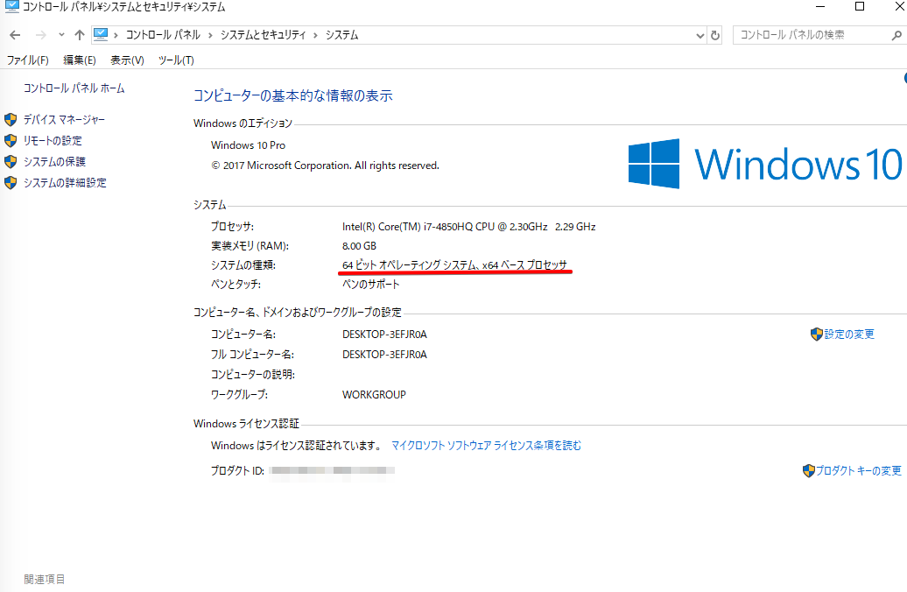
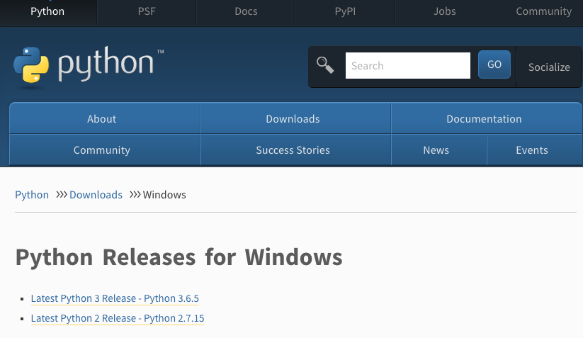
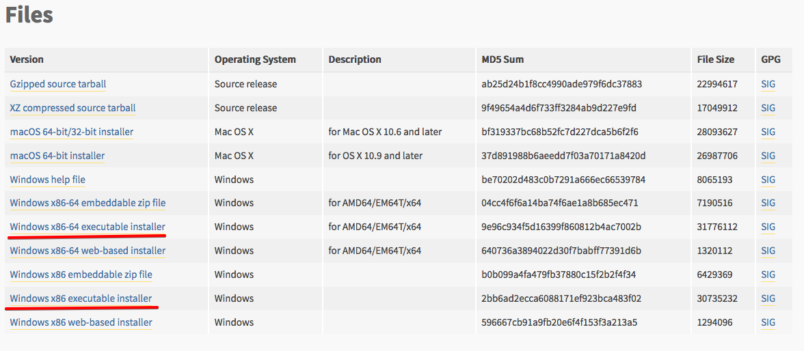
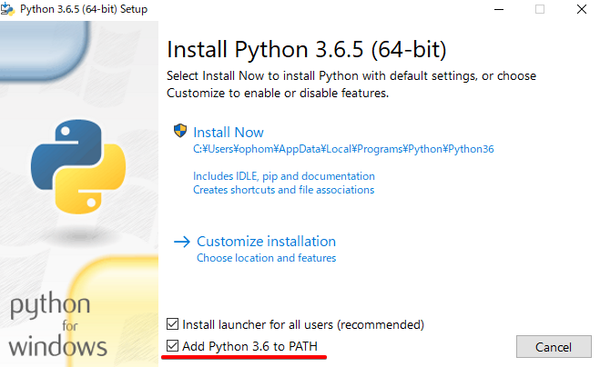
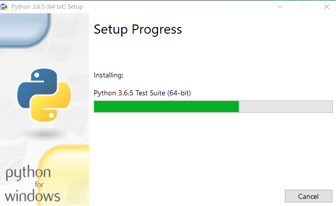
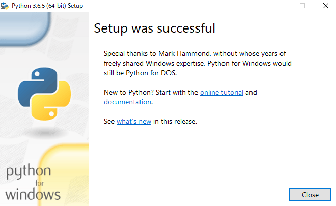
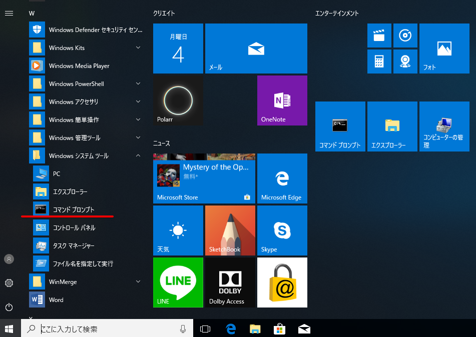
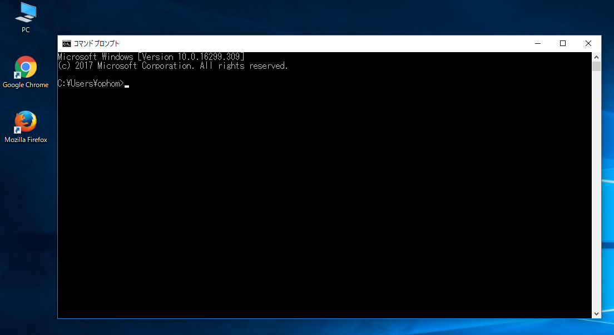
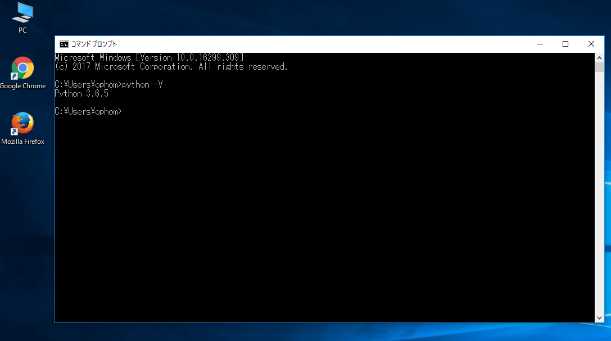

インストール
========

下記のライブラリをインストールします

* Python3.5以上
* PostgreSQL 9.5以上
    - PostGIS 2.x
* GISライブラリ    
    - GDAL(Geospatial Data Abstraction Library) 
    - GEOS (Geometry Engine, Open Source) 
    - PROJ4 (Cartographic Projections Library) 

Django入門で、Django Girls Tutorialというものがあります。
[Django Girls](https://djangogirls.org/)というコミュニティが作成したチュートリアルですが、ここのインストールの説明がとてもわかり易く解説しているのでこれを参考にしています。

---

### 参考URL

#### Django Girls Tutorial
* [Django Girls Tutorial 英語版](https://tutorial.djangogirls.org/en/)
* [Django Girls Tutorial 日本語版](https://djangogirlsjapan.gitbooks.io/workshop_tutorialjp/content/)

#### Python
プログラミング言語の一つ。コードの可読性を高めた言語です。

* [Python 公式サイト](https://www.python.org/)

#### Django
Pythonで作成されたWebアプリケーションを作成するフレームワークです。
GeoDjangoはDjangoに含まれている地理空間データ用のモジュールです。

* [Django 公式サイト](https://www.djangoproject.com/)
* [Django 日本語公式サイト](http://djangoproject.jp/)

#### PostgreSQL
オープンソースのリレーショナルデータベースです。

* [PostgreSQL](https://www.postgresql.org/)
* [日本PostgreSQLユーザ会](https://www.postgresql.jp/)

##### PostGIS
PostGISは PostgreSQLデータベースに地理空間情報を扱うための機能拡張をする拡張ライブラリです。

* [PostGIS(OSGeo)](http://www.postgis.net/)
    - [PostGIS](http://postgis.refractions.net/)

##### GDAL(Geospatial Data Abstraction Library) 
OSGeo財団が提供しているGISラスターデータフォーマット用ライブラリ。
ラスタおよびベクトル地理空間データ変換ライブラリ

* [GDAL(Geospatial Data Abstraction Library)](http://www.gdal.org)

#### GEOS (Geometry Engine, Open Source) 
地理空間情報処理のためのオープンソースライブラリで、OSGeo財団が支援している。
幾何演算ライブラリ

* [Geometry Engine, Open Source](http://trac.osgeo.org/geos/)

#### PROJ4 (Cartographic Projections Library) 
一般的な座標変換ソフトウェア。
投影変換ライブラリ

* [PROJ4 (Cartographic Projections Library)](http://proj4.org/)

### OSGeo財団
OSGeo財団（The Open Source Geospatial Foundation）は、オープンソース地理空間ソフトウェアの支援と構築のために設立されたコミュニティーです。

* [OSGeo財団](https://www.osgeo.org/)
* [OSGeo財団日本支部（OSGeo.JP）](https://www.osgeo.jp/)

---
 
Pythonのインストール
-----

Python 3.6 をインストールします。

### Windows

Windowsのシステム情報でシステムの種類が32-bitバージョンか64-bitバージョンかを確認してください。  
(例）コントロールパネル>システムとセキュリティ>システムを開く

    

Python for Windowsを <https://www.python.org/downloads/windows/>　からダウンロードしてください。最新版の「Latest Python 3 Release - Python 3.6.5」(2018年6月4日現在)をダウンロードしてください。

    Python Releases for Windows    
        Latest Python 3 Release - Python 3.6.5
        Latest Python 2 Release - Python 2.7.15

    

* 64ビット版のWindowsの場合
    -  "Windows x86-64 executable installer" (Windows x86-64実行可能インストーラー)をダウンロードしてください。 
* 32ビット版のWindowsの場合 
    - "Windows x86 executable installer" (x86実行可能インストーラー)をダウンロードしてください

    

インストーラをダブルクリックして実行します。ダイアログが表示されるので、
「Add Python 3.x to Path」を忘れずに必ずチェックしてから「Install Now」をクリックします。

    

インストーラーが実行されるので、終了まで待ちます。

    

インストーラーが終了するとダイアログが表示されるので「Close」ボタンをクリックして終了します。

    

コマンドプロンプトを実行します。  
例）スタートメニュー→すべてのプログラム→アクセサリ→コマンドプロンプト

    

コマンドプロンプトが実行されます。

    

「python -V」を入力して、Pythonがインストールされたバージョンを確認します。

    例）python -V

    

**注意** パソコンの環境によって「python」ではなく「python3」という場合があります

    例）python3 -V

pipのバージョンも確認します

    C:¥xxx> pip --version
    pip 9.0.3 from xxx (python 3.6)

### Mac（OSX）

Python for Macを <https://www.python.org/downloads/mac-osx/>　からダウンロードしてください。最新版の「Latest Python 3 Release - Python 3.6.5」(2018年6月4日現在)をダウンロードしてください。

    Python Releases for Mac OS X
        Latest Python 3 Release - Python 3.6.5
        Latest Python 2 Release - Python 2.7.15

OSの環境によって、macOS 64-bit/32-bit installer(for Mac OS X 10.6 and later)または、macOS 64-bit installer（for OS X 10.9 and later）を選択してダウンロードしてください。
ダウンロードされたら、pkgファイル（python-3.6.5-macosx10.6.pkg）をクリックしてインストーラーを実行してください。

インストールが正しく行われたか確認するために、 ターミナルを開いて、python3もしくはpythonコマンドタイプしてみてください

    $ python3 -V
    Python 3.6.5

**注意** Macの場合、デフォルトでpython2がインストールされています。必ずバージョンを確認して[
「python -V」が2系だった場合は、「python3」を使うようにしてください

    $ python -V
    Python 2.7.14

pipのバージョンも確認します

    $ pip --version
    pip 9.0.3 from xxx (python 3.6)

----

PostgreSQLのインストール
----

### Windows
### Mac（OSX）

----

PostGISのインストール
-----

### Windows
### Mac（OSX）

----

GISライブラリ
-----
- GDAL(Geospatial Data Abstraction Library) 
- GEOS (Geometry Engine, Open Source) 
- PROJ4 (Cartographic Projections Library) 

### Windows
### Mac
