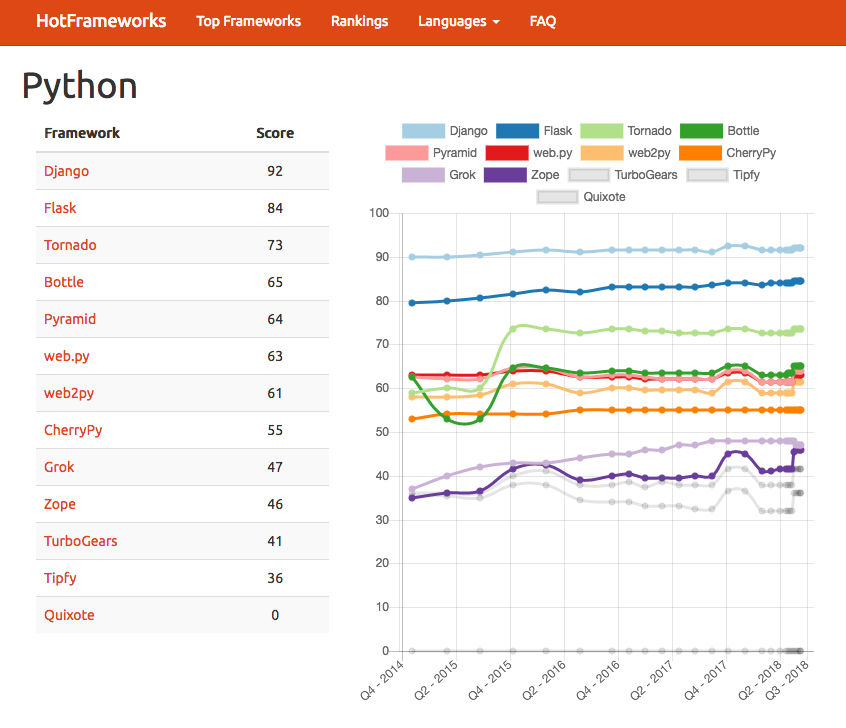
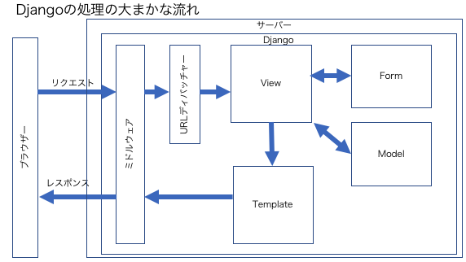

# Djangoの概要

## Djangoとは
Django（ジャンゴ）はPythonで実装されたWebフレームワークで、2005年にオープンソース 
<https://github.com/django/django> (BSD license)で公開されました。

最新版は、2017年12月に9年ぶりとなるメジャーバージョンアップされてDjango 2.0.6 (2018/6/11現在)となります。
バージョン2.0からPython3.5以上のみがサポート対象となりました。
Python2系の場合は、Django 1.11 LTSでPython 2.7をサポートしています。

日本語の情報も少なくないといわれていましたが、最近では日本語の書籍や情報も増えてきています。

<u>**特徴**</u>
* All In One
    - 開発者ができるだけ早くアプリケーションを完成できるように設計
* DRY (Don't Repeat Yourself)
    - ソフトウェア開発全体において情報を重複させない
* MTV fraemwork
    - Model, View, Templateフレームワーク
* Reassuringly secure
    - セキュリティを担保している

参考: Design philosophies - https://docs.djangoproject.com/en/1.11/misc/design-philosophies/

HotFramework - https://hotframeworks.com/languages/python

    

<u>**Djangoアプリの基本的な構成例**</u>

    

