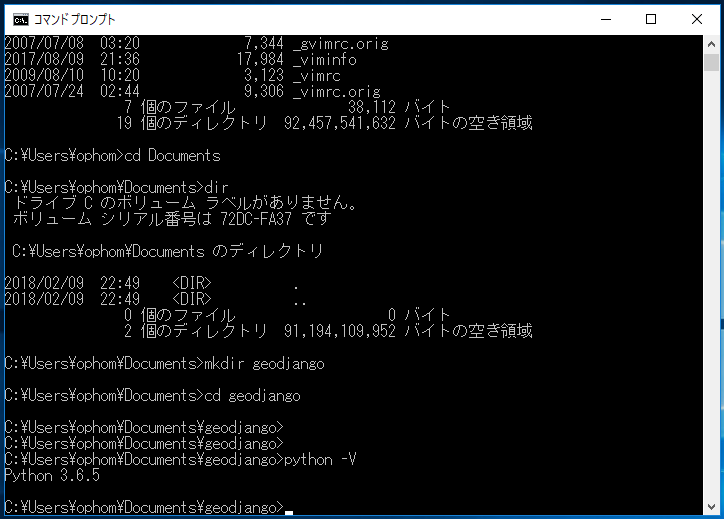

# Djangoのインストール

PythonとDjangoは下記のバージョンで説明をします。

* Python 3.6.5
* Django 2.0.6

コンソール (コマンドプロンプト)を開いて作業をします

    

<u>**Note**</u>
* ソースコードを編集するにはエディターを利用します。資料ではエディターは「vi」としています記述をしています。適宜、お使いの環境のエディターに置き換えてください。
* エディターがインストールされていない場合は、Visual Studio Code <https://www.microsoft.com/ja-jp/dev/products/code-vs.aspx> 等をインストールしてください。
* 統合環境で開発する場合は、JetBrain社の PyCharm Community - https://www.jetbrains.com/pycharm/download/ であれば無料で利用することが出来ます。

## Pythonのバージョン

Pythonのバージョンを3.6系であることを確認します。

    $ python -V
    Python 3.6.5

<u>**Note:**</u> 
* インストールした環境により python → python3 と"3"を付与する必要がある場合があります
* Windowsの場合「$」を「C:\Users\<xxxx>\Documents\geodjango>」とコマンドプロンプトの表示を読み換えてください

## 仮想環境構築

venvモジュールを使って仮想環境を構築します。
仮想環境を使うことで個別にPythonの動作環境が作成することが出来ます。

仮想環境作成

$ python -m venv <仮想環境の名前(例)env)> 

    $ mkdir geodjango
    $ cd geodjango
    $ python -m venv env
    MacOSの場合
        $ ls
        env/
    Windowsの場合
        c:¥> dir
        2018/06/12  14:48 <DIR> env

仮想環境モードになる

    MacOSの場合
        $ source env/bin/activate
        (env) $
    Windowsの場合
        c:¥> env¥Scripts¥activate.bat
        (env) c:¥>

仮想環境から抜けたい場合

    無効化（deactivate）する
    $ deactivate

## Djangoのインストール

    インストール済みパッケージを確認
    (env) $ pip freeze  (インストール済みのパッケージを必要とされるフォーマットで出力)
　　 全てを表示する
    (env) $ pip list    (インストール済みの全てのパッケージリストの表示)

    パッケージソフトウェアpipをアップグレード
    (env) $ pip install --upgrade pip

    バージョン確認
    $ pip -V
    
    エラーが出たら"--force-reinstall" オプションをつけて再度アップグレード
    (env) $ pip install --force-reinstall --upgrade pip
    または
    (env) $ python -m pip install --force-reinstall --upgrade pip

    Djangoインストール
    (env) $ pip install django
    または
    (env) $ pip install django==2.0.6　<= バージョン指定

    インストール済みパッケージを確認
    (env) $ pip freeze
    Django==2.0.6
    pytz==2018.4

    Djangoのバージョン確認
    (env) $ python -m django --version
    2.0.6
