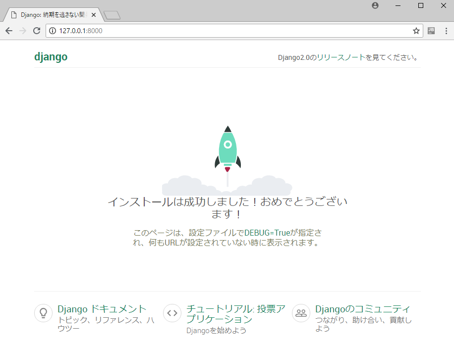
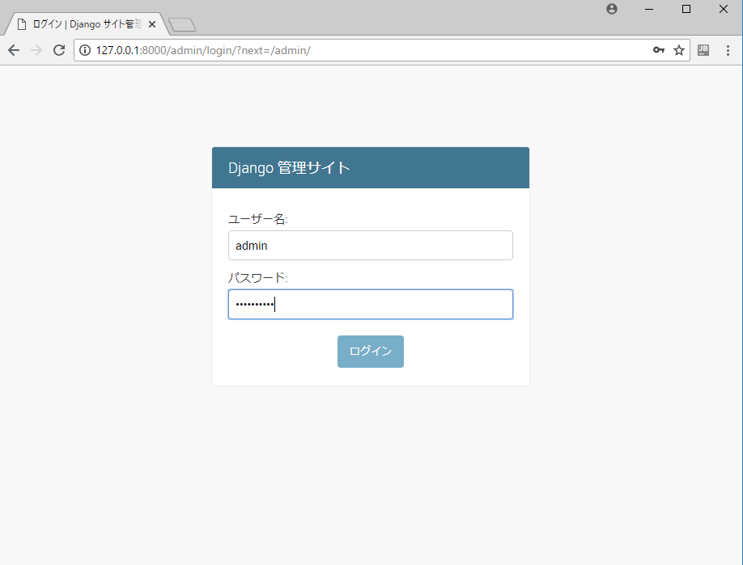
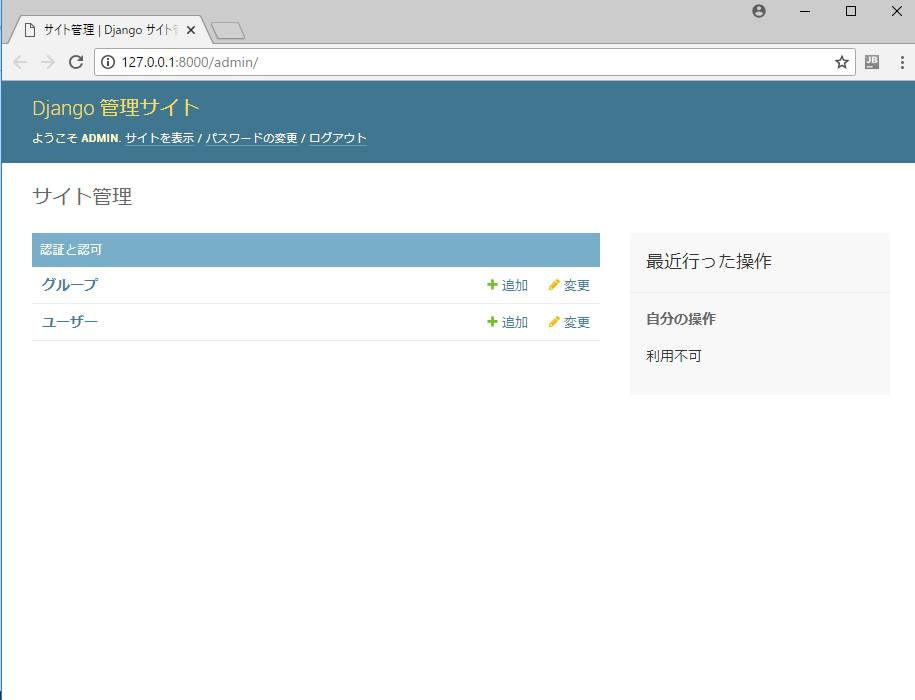

# Djangonのチュートリアル

## Djangoの構成

Djangoでは「プロジェクト」と「アプリケーション」という要素がります。

* プロジェクト
    - DjangoのWebアプリ全体を指します。
* アプリケーション
    - 機能や要素単位でまとめたものでプロジェクトは複数のアプリケーションを持ちます。

プロジェクトとアプリケーションの関係

    Djangoプロジェクト
        ├── プロジェクト設定
        ├── アプリケーション1
        ├── アプリケーション2
            :
        └── アプリケーションxxx

Djangoでは、アプリケーションごとに開発を進めていきます。

また、アプリケーションは疎結合（Loose coupling）という考えでアプリケーション間の依存は極力減らして開発をします。

## プロジェクト構成

プロジェクトの作成は下記のコマンドで作成をします。
これがWebアプリのルートとなります。

プロジェクト作成コマンド 
$ django-admin startproject <プロジェクト名>

    MacOSの場合
    (env) $ django-admin startproject geodjango
    (env) $ cd geodjango

    Windowsの場合
    (env) C:¥> python env\Scripts\django-admin.py startproject geodjango
    (env) C:¥> cd geodjango

Django標準のファイル構成

    geodjango              <-- プロジェクトのルート
    ├── manage.py      <-- プロジェクトの管理用のスクリプト
    └── geodjango      <-- プロジェクト設定
        ├── __init__.py   <-- Pythonの初期化処理パッケージファイル
        ├── settings.py   <-- プロジェクトの設定ファイル
        ├── urls.py       <-- プロジェクトのURLパターン設定ファイル
        └── wsgi.py       <-- プロジェクトのWSGI(ウィズギー)インターフェース設定ファイル

## 設定変更

Webアプリの「言語」と「タイムゾーン」を自分の地域に設定します。
設定は設定ファイルの「geodjango/settings.py」を編集します。

(env) $ vi geodjango/settings.py

    編集前
    106: LANGUAGE_CODE = 'en-us'
    107:
    108: TIME_ZONE = 'UTC'
      :
    113:
    114: USE_TZ = True

    編集後
    106: LANGUAGE_CODE = 'ja-JP'
    107:
    108: TIME_ZONE = 'Asia/Tokyo'
      :
    113:
    114: USE_TZ = True

<u>**Note:**</u> 

* タイムゾーンは、ウィキペディアのList of tz database time zones - <http://en.wikipedia.org/wiki/List_of_tz_database_time_zones>が参考になります。

## データベースの設定

この現時点では、デフォルトのSQLiteデータベースで動作確認をします。
ENGINEの項目を変更することで、PostgreSQLやMySQLなどに変更することが出来ます。

MacOSの場合で、SQLiteがインストールされて無い場合はbrewコマンドでイントールしてください。

    (env) $ brew update
    (env) $ brew install sqlite3
    (env) $ sqlite3 -version
        3.19.3 2017-06-27 16:48:08 2b0954060fe10d6de6d479287dd88890f1bef6cc1beca11bc6cdb79f72e2377b

設定ファイル「geodjango/settings.py」でSQLiteデータベースの設定の確認をします。

$ vi geodjango/settings.py

    DATABASES = {
        'default': {
            'ENGINE': 'django.db.backends.sqlite3',
            'NAME': os.path.join(BASE_DIR, 'db.sqlite3'),
        }
    }

manage.py migrateコマンドを実行して、データベースにテーブルを作成します。

    (env) $ python manage.py migrate
    Operations to perform:
    Apply all migrations: admin, auth, contenttypes, sessions
    Running migrations:
    Applying contenttypes.0001_initial... OK
    Applying auth.0001_initial... OK
    Applying admin.0001_initial... OK
    Applying admin.0002_logentry_remove_auto_add... OK
    Applying contenttypes.0002_remove_content_type_name... OK
    Applying auth.0002_alter_permission_name_max_length... OK
    Applying auth.0003_alter_user_email_max_length... OK
    Applying auth.0004_alter_user_username_opts... OK
    Applying auth.0005_alter_user_last_login_null... OK
    Applying auth.0006_require_contenttypes_0002... OK
    Applying auth.0007_alter_validators_add_error_messages... OK
    Applying auth.0008_alter_user_username_max_length... OK
    Applying auth.0009_alter_user_last_name_max_length... OK
    Applying sessions.0001_initial... OK

    (env) $ ls
    db.sqlite3  geodjango/  manage.py

## Webアプリの動作確認

ここまで上手く出来ているかを確認します。

manage.pyのrunserverコマンドを実行することで、Djangoのサーバーを起動します。

    Webアプリ起動
    (env) $ python manage.py runserver
        Performing system checks...

        System check identified no issues (0 silenced).
        June 12, 2018 - 16:54:28
        Django version 2.0.6, using settings 'geodjango.settings'
        Starting development server at http://127.0.0.1:8000/
        Quit the server with CTRL-BREAK.
        [12/Jun/2018 16:54:37] "GET / HTTP/1.1" 200 16510
        [12/Jun/2018 16:54:37] "GET /static/admin/css/fonts.css HTTP/1.1" 200 423
        [12/Jun/2018 16:54:37] "GET /static/admin/fonts/Roboto-Regular-webfont.woff HTTP/1.1" 200 80304
        [12/Jun/2018 16:54:37] "GET /static/admin/fonts/Roboto-Bold-webfont.woff HTTP/1.1" 200 82564
        [12/Jun/2018 16:54:37] "GET /static/admin/fonts/Roboto-Light-webfont.woff HTTP/1.1" 200 81348
        Not Found: /favicon.ico
        [12/Jun/2018 16:54:38] "GET /favicon.ico HTTP/1.1" 404 1975

ブラウザからURL: http://127.0.0.1:8000/ にアクセスをします。
上手く作成できていれば、下記の画面が表示されます。

    

停止する時は、CTRL+C（コントロールとCボタンを同時に押す）です。
Windowsの場合は、Ctrl+Breakで停止することがあります。

## 管理画面

管理画面にログイン権限のある管理ユーザのアカウントを作成します。

    Webアプリ起動されていたら、CTRL+Cで一旦止めます

    管理ユーザのアカウントを作成します
    (env) $ python manage.py createsuperuser
    Username (leave blank to use 'homata'): admin
    Email address: hoge@fuga.com
    Password: xxxxxx
    Password (again): xxxxxx
    Superuser created successfully.

    Webアプリを再起動します
    (env) $ python manage.py runserver

Webアプリ起動後、http://127.0.0.1:8000/admin にアクセスして作成したアカウントでログインして確認します。

ログイン画面が表示されたら作成したアカウントとパスワードを入力します。

    

ログイン後、 管理画面が表示されれば管理画面は正常に動作しています。

    

