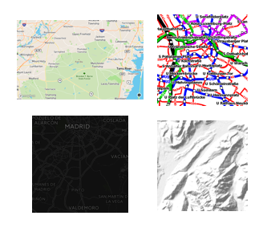

# 背景地図 (ベースマップ)

背景地図 (ベースマップ)は、選択することで様々な地図表現が出来ます。

## 代表的な背景地図

### Googleマップ 
* <https://www.google.co.jp/maps/>
* 地図データ株式会社ゼンリンのデータ使用している
* 利用規約がある (例）印刷して道案内のガイドブックに利用は不可
* Google Maps JavaScript APIはフリーミアムモデル
    - 1日あたり最大 25,000 回のマップロードが無料 (他のモデルもあり)

### OpenStreetMap 
* <https://www.openstreetmap.org/>
* 誰でも自由に利用でき、ユーザ自身が編集することが可能な世界地図のデータセット
* 編集にルールがある。例）事実データしか入力出来ない
* ライセンスはオープンデータベースライセンス (ODbL)
* 無料で利用可能
* データの2次利用と配布が可能

### 地理院地図 
* <https://maps.gsi.go.jp/>
* 国土地理院が提供しているWeb地図
* 地形図や写真の表示か可能
* ライセンスは国土地理院コンテンツ利用規約

### Mapbox 
* <https://www.mapbox.com/>
* アプリケーション向けオンラインカスタムマップ
* フリーミアムモデル
* 米国カリフォルニアに本社がある法人
* 様々な地図表現が出来る

    

* https://wiki.openstreetmap.org/wiki/JA:タイル

