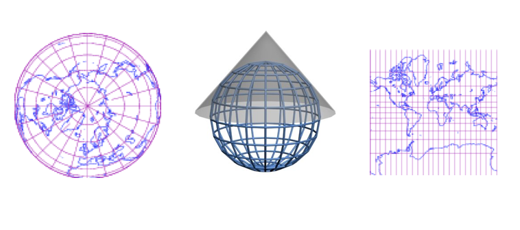
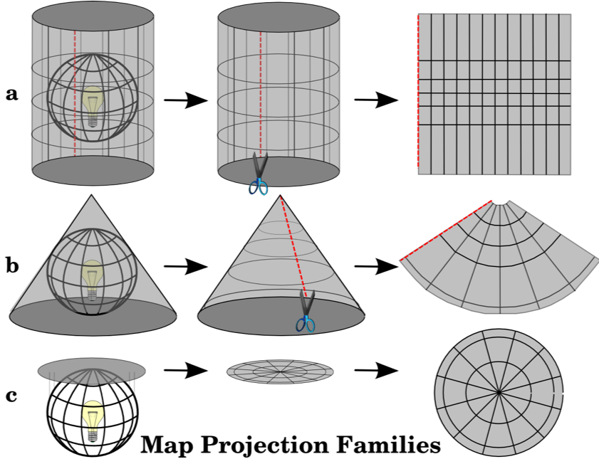
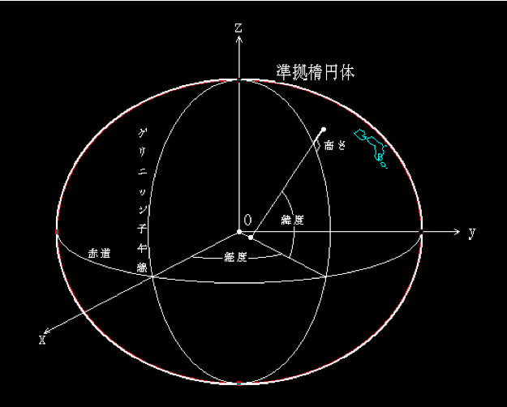
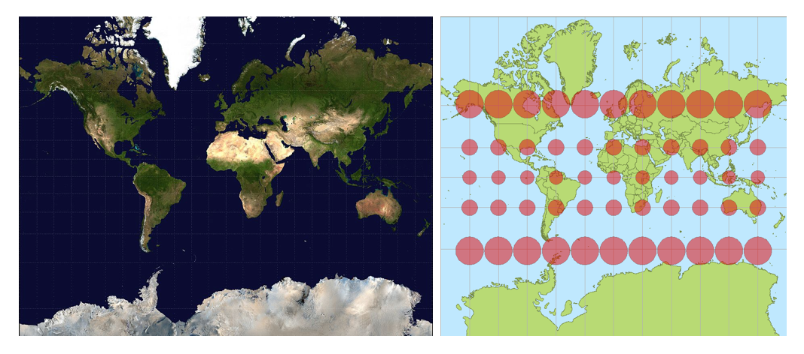
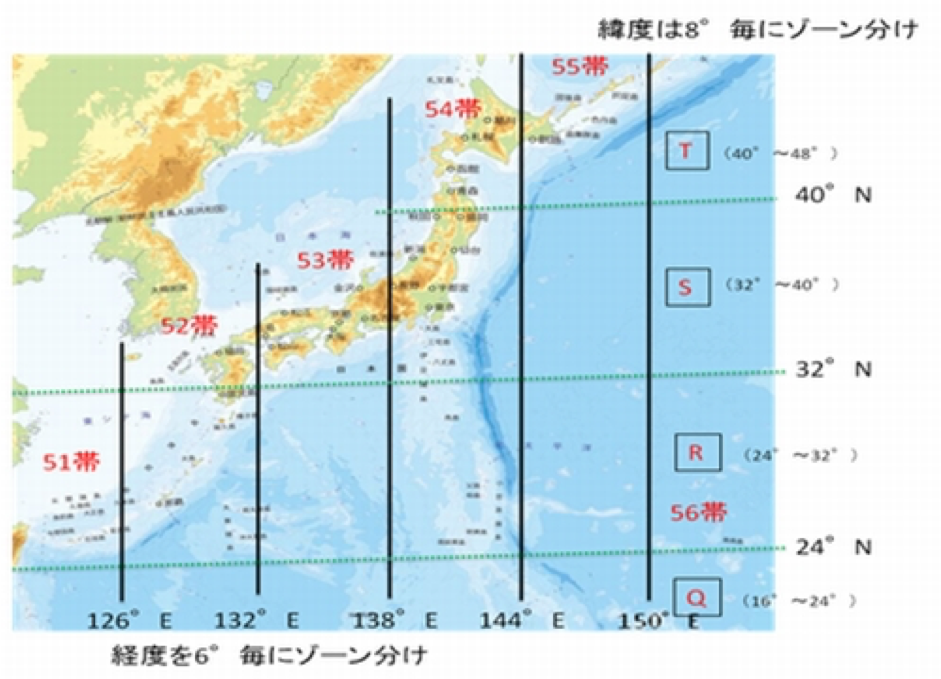
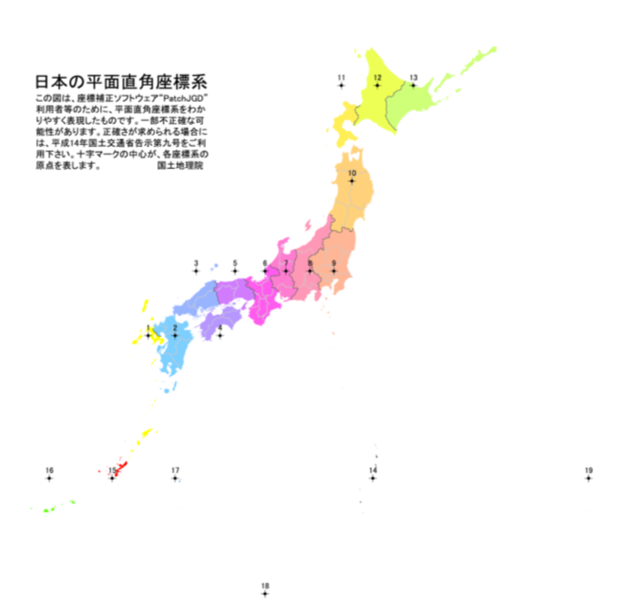

# 測地系と座標系

## 地理空間データ
地理空間データは位置を示すために様々な座標が定義されている。
座標系は大きく分けると経緯度で定義された地理座標系と平面上で定義された投影座標系の2つがある。

### 測地系
測地系とはその経緯度の座標で表す時の座標の基準(点)。
モデルとして採用する地球（楕円体）の形によって分かれる

#### 分類
* 世界測地系 - 国際的に定められた測地系
    - 例）日本測地系2011(JGD2011)、WGS84、日本測地系2000(JGD2000)
* 日本測地系 - 2002年の測量法改正以前は、この測地系を使った測量が行われていた
    - 旧測地系とも呼ばれている。日本でも測地系は2002年(平成14年)4月から測量法により世界測地系へ移行されることになった。
    - 例)日本測地系TOKYO

### 座標系
地球上の球面(3次元の立体)を2次元の地図の平面上に表現する方法。

#### 分類
* 地理座標系
    - 3次元(X,Y,Z)で位置を表現。赤道を経度 0 度(Y))、旧グリニッジ天文台跡緯度0度(X) とした座標系
    - 地球の重心付近を原点としている。真の重心はわからないので統一はされてない
    - 世界等の広域で表現可能だが、地球は真円ではないので面積や角度が正確でない
* 投影座標系
    - 3次元である地球を 2 次元の平面に投影し、XY 座標で表現する座標系
    - 地球を平面に投影した面上における原点からの距離でXY 座標で表現する座標系
    - 用いる投影法によって、距離・面積・角度のいずれかを正確に表現できる
    - 正しい形状での地図表現、図形の作図、距離や面積による解析などを行う場合は、投影座標系を用いる

    

* https://www.esrij.com/gis-guide/coordinate-and-spatial/coordinate-system/

## 投影座標系

形状・距離・方位・面積等の全てを正確に保つ事は不可能なため、用途に応じて様々な方法・分類がある。

### 性質による分類 
* 正積図法：面積が正しい
* 正角図法：任意の二地点間を結んだ直線と経線のなす角度が正しい
* 正距図法：距離が正しい

### 投影法で分類
* 方位図法：地球の周辺に置かれた平面に地球の姿を投影する。
* 円錐図法：地球に傘のような円錐をかぶせて地球の姿を投影し、平面に切り広げる。
* 円筒図法：地球に帯を巻くように円筒をかぶせて地球の姿を投影し、平面に切り広げる。

    

* https://ja.wikipedia.org/wiki/方位図法  
* https://ja.wikipedia.org/wiki/円錐図法  
* https://ja.wikipedia.org/wiki/円筒図法

### The three families of map projection地図投影法の大きな3つ

    

* https://docs.qgis.org/2.8/en/docs/gentle_gis_introduction/coordinate_reference_systems.html

### 日本でよく使われる代表的な座標系

日本では一般に以下の３つが多く利用されている

#### 地理座標系 
* 緯度経度の3次元(X,Y,Z)で座標を表す
* 赤道を経度0度(Y)、旧グリニッジ天文台跡を緯度0度(X) とした座標
* 原点は地球の重心付近

#### 投影座標系
* メルカトル図法
    * 地球を円筒状にしてXY座標で場所を表す
* UTM座標系 (ユニバーサル横メルカトル図法)
    * 地球を6度ずつ60の帯(ゾーン)に縦に分割した座標
* 平面直角座標系
    * 日本国内を土地の状況に合わせて19に分割した座標

### EPSGコードとSRID

#### OGC 
OGCは(Open Geospatial Consortium) <http://www.opengeospatial.org/>は、自発的合意に基づく国際的な標準化機構です。
業界主導で地理情報の標準化に取り組んでいる非営利団体

#### EPSG
EPSG（European Petroleum Survey Group）という団体によって作成された、測地系、座標系、地図投影法等をコード体系にしたもの。現在は、イギリスのInternational Association of Oil & Gas Producers（OGP）が管理している。

例) EPSG:4326 -> 世界測地系 WGS84,地理座標系  
EPSGオフィシャルの検索サービスは http://www.epsg-registry.org/

#### SRID
SRID(空間参照系識別コード(Spatial Reference System Identifier)) は、“出典コード(オーソリティ):(整数コード)”とし定義されたコード体系。
EPSGで定義されたものを始めとして、さまざまな標準 SRID が認められている。整数コードの重複を回避するためのものではあるが、オーソリティのコードを省略した場合は、 EPSGコードとして認識されることが多いので、 SRID=EPSGコードと考えてよい

例) SRID(EPSG:4326) ≒ ERSG(4326)

### 地図系アプリケーションでよく使われるコード

| SRID | 測地系         | 座標系    | 目的                    |
|:-----|:--------------|:---------|:------------------------|
| 4326 | WGS84         | 地理座標系 | GPSで得られる位置　緯度経度 |
| 4301 | 日本測地系TOKYO | 地理座標系 | 日本測地系 経度緯度       |
| 4612 | JGD2000       | 地理座標系 | 世界測地系 経度緯度       |

EPSG:4326は、米軍が策定した測地系でGPS等に使われている。GPSデータ等のデータはこれが主流となっている。

    

* http://www.gsi.go.jp/sokuchikijun/datum-main.html

### メルカトル図法

| SRID | 測地系 | 座標系 | 目的 |
|:-----|:------|:------|:-----|
| 3857 (900913) | WGS84 | 球面(半径6378137m)メルカトル図法 | Google Maps等各種ウェブ地図アプリケーション。緯度経度で表現 |

地球を円筒状にしてXY座標で場所を表す。正角円筒図法ともいう。

EPSG:3857 は、Webアプリケーションのデファクトコードになっている。 Googleによって作成されたものでWebメルカトルとも呼ばれている。緯度約85度以上の北極や南極周辺の地図を表現するのをあきらめて範囲を限定した投影法(一般的な利用シーンでは問題とならないと判断した)で、すばやく地図を表示できるようにしたもの。非公式にはGoogleをもじってEPSG:900913とも言われているがEPSGレジストリには登録されていない。BingMap等にも使われている

    

* https://ja.wikipedia.org/wiki/メルカトル図法

### UTM座標系 (ユニバーサル横メルカトル図法)

| SRID | 測地系 | 座標系 | 目的 |
|:-----|:------|:------|:-----|
| 51 | 6688 | 3097 | 東経120-126 |
| 52 | 6689 | 3098 | 東経126-132 |
| 53 | 6690 | 3099 | 東経132-138 |
| 54 | 6691 | 3100 | 東経138-144 |
| 55 | 6692 | 3101 | 東経144-150 |

地球を6度ずつ60の帯(ゾーン)に縦に分割した座標

    

* http://d.hatena.ne.jp/tmizu23/20091215/1260868350
* http://www.gsi.go.jp/chubu/minichishiki10.html

### 19の平面直角座標系 

| 系 | EPSG(JGD2011) | EPSG(JGD2000) | 区域 |
|:---|:--------------|:--------------|:----|
| 1  | 6669 | 2443 | 長崎県、鹿児島県の一部 |
| 2  | 6670 | 2444 | 福岡県、佐賀県、熊本県、大分県、宮崎県、鹿児島県の一部 |
| 3  | 6671 | 2445 | 山口県、島根県、広島県 |
| 4  | 6672 | 2446 | 香川県、愛媛県、徳島県、高知県 |
| 5  | 6673 | 2447 | 兵庫県、鳥取県、岡山県 |
| 6  | 6674 | 2448 | 京都府、大阪府、福井県、滋賀県、三重県、奈良県、和歌山県 |
| 7  | 6675 | 2449 | 石川県、富山県、岐阜県、愛知県 |
| 8  | 6676 | 2450 | 新潟県、長野県、山梨県、静岡県 |
| 9  | 6677 | 2451 | 東京都の一部、福島県、栃木県、茨城県、埼玉県、千葉県、群馬県、神祭川県 |
| 10 | 6678 | 2452 | 青森県、秋田県、山形県、岩手県、宮城県 |
| 11 | 6679 | 2453 | 北海道の一部 |
| 12 | 6680 | 2454 | 北海道の一部 |
| 13 | 6681 | 2455 | 北海道の一部 |
| 14 | 6682 | 2456 | 東京都の一部 |
| 15 | 6683 | 2457 | 沖縄県の一部 |
| 16 | 6684 | 2458 | 沖縄県の一部 |
| 17 | 6685 | 2459 | 沖縄県の一部 |
| 18 | 6686 | 2460 | 東京都の一部 |
| 19 | 6687 | 2461 | 東京都の一部 |

狭い範囲だけを投影して歪みを少なくして、投影する図法日本国内を土地の状況に合わせて19に分割した座標

    

* http://www.gsi.go.jp/sokuchikijun/jpc.html
* http://d.hatena.ne.jp/tmizu23/20091215/1260868350

