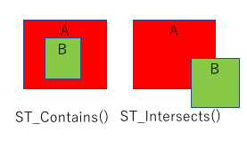
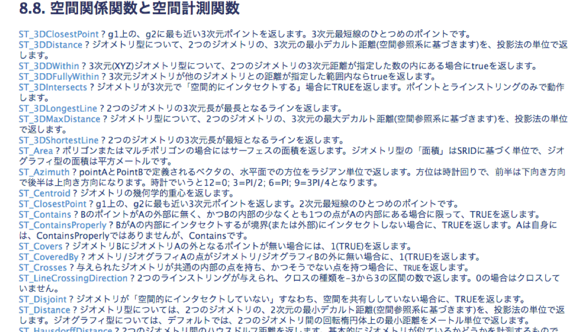
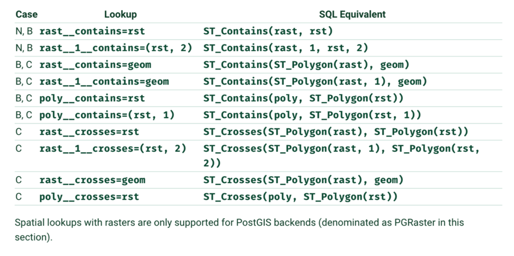

# Geoデータベース

## GeoDjangoサポート 空間データベース

| Database   | Library Requirements | Supported Versions | Notes |
|:-----------|:---------------------|:-------------------|:------|
| PostgreSQL | GEOS, GDAL, PROJ.4, PostGIS | 9.4+  | Requires PostGIS. |
| MySQL      | GEOS, GDAL                  | 5.6+  | Not OGC-compliant; limited functionality. |
| Oracle     | GEOS, GDAL                  | 12.1+ | XE not supported. |
| SQLite     | GEOS, GDAL, PROJ.4, SpatiaLite | 3.7.15+ | Requires SpatiaLite 4.1+ |

**Note**:
PostGIS is recommended, because it is the most mature and feature-rich open source spatial database.

* https://docs.djangoproject.com/en/dev/ref/contrib/gis/install/#requirements

## PostGIS

* PostGIS <http://postgis.refractions.net/> はカナダにあるRefractions Research Inc.が開発したもの。
* GEO界隈ではデファクトのデータベース
* PostgreSQLに地理空間情報を扱うための拡張機能。
    - PostgreSQLにExtension(postgis)を追加する
* データベースにGEOMETRY型が追加される
    - POINT(点)、LINESTRING(線), POLYGON(面)が基本となるる
* 幾何関数という空間演算用の関数が追加される(ST_xxx)
* 空間インデックスをGEOMETRY型につける

### PostGISの空間演算用の関数

* PostGISの地理空間関数。ST_xxxxとSTで始まるものが多い

    SQL例）
    > SELECT ST_Area(geog) FROM somegeogtable;
    > SELECT road_id, ST_AsText(road_geom) AS geom, road_name FROM roads;

**関数例)** 
* ST_Contains() - AがBを含んでいるのかのかチェックする
* ST_Intersects() - AとBが重なっているのかチェックする
* ST_Distance () – AとBの距離を求める
* ST_Area () – ポリゴンの面積を求める
  :  

    

* https://qiita.com/yellow_73/items/dc7c5e1ebe95625aee60  
* https://www.finds.jp/docs/pgisman/1.5.1/reference.html  
* http://cse.naro.affrc.go.jp/yellow/pgisman/2.0.0/postgis.html#Spatial_Relationships_Measurements

### PostGISの空間演算用の関数

    

    

* https://docs.djangoproject.com/en/2.0/ref/contrib/gis/geoquerysets/  A
* https://www.finds.jp/docs/pgisman/1.5.1/reference.html

