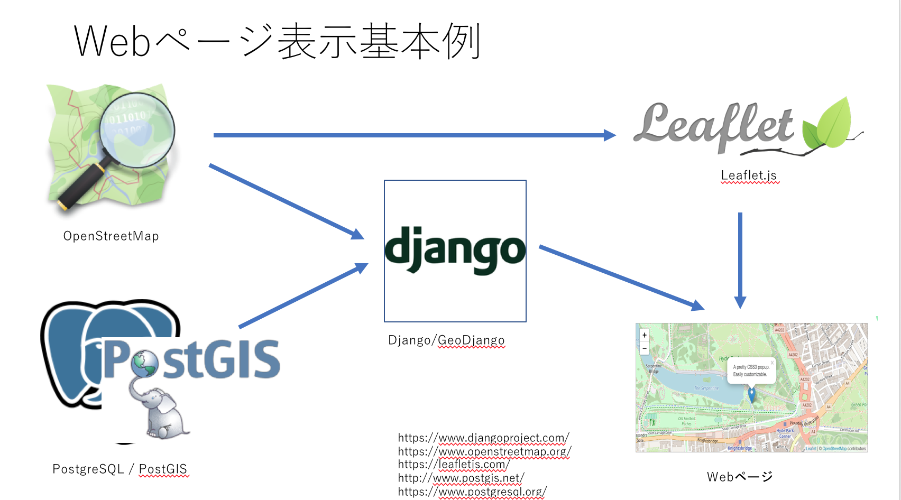
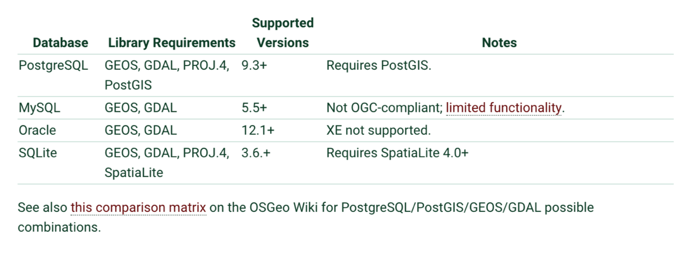
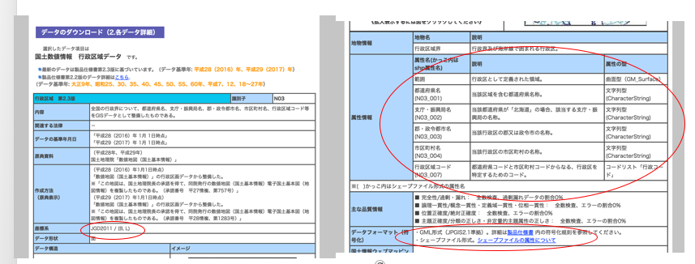
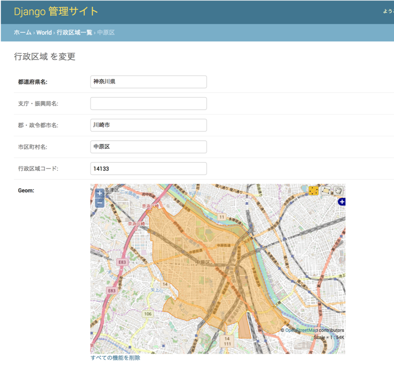
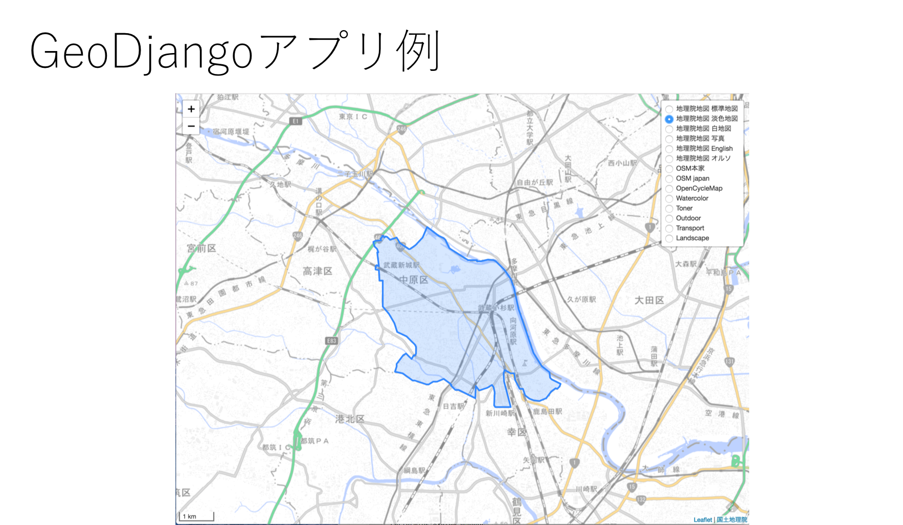
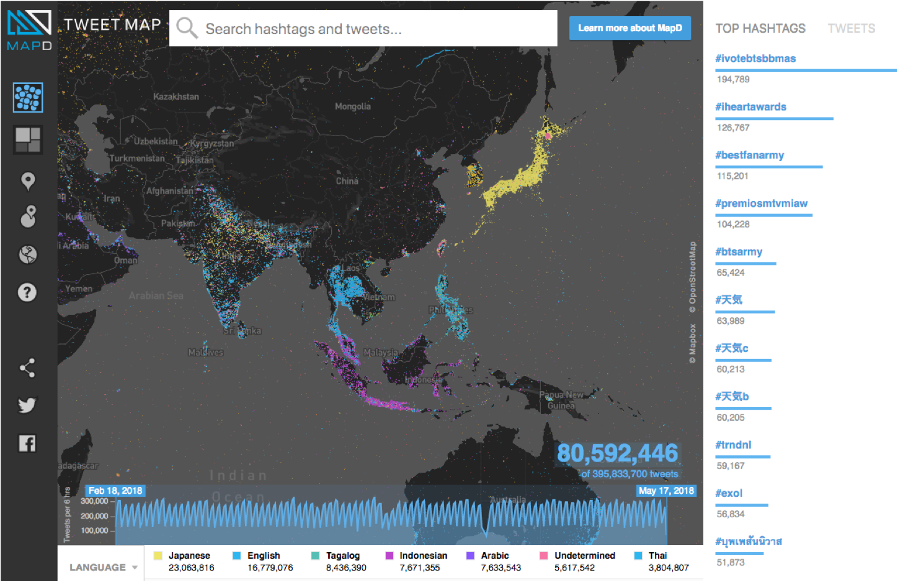
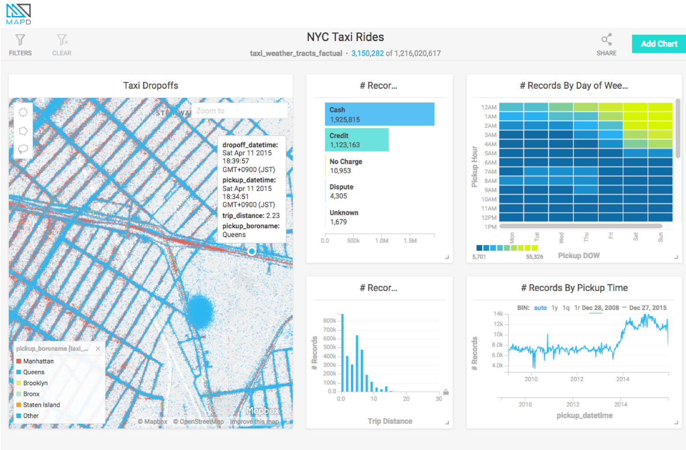
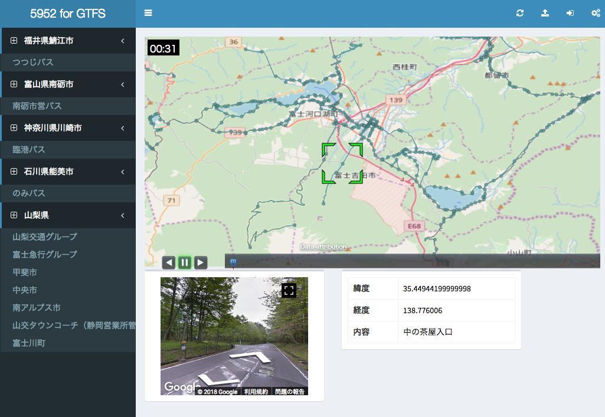

# GeoDjangoの概要

## GeoDjangoとは
GeoDjangoはDjangoに含まれている地理空間データ用のモジュールです
地理情報システム (GIS) のWeb アプリケーションが作成が可能になります

<u>**特徴**</u>
* Modelに地理空間情報フィールド を追加 (GeometryField, PointField ...)
* ORMで空間演算に対応 (rast__contains (ST_Contains) ....)
* Djanngoの管理画面で地理地理情報フィールドの編集 (GeoModelAdmin  ...)
* 地理空間情報APIを追加 (GeolocationAPI ...)
* Manageコマンド (GeoDjango Management Commands)

<u>**GeoDjango Webアプリの基本的な構成例**</u>

<div align="center" style="margin-bottom:50px;margin-top:30px">
    
</div>

## GeoDjangoのポイント

### Geospatial libraries and Spatial database
* GDAL, GEOS, PROJ4をインストール
* PostgresSQL, PostGIS / MySQL / Oracle / SQLite, SpatialLiteのどれかをインストール

<div align="center" style="margin-bottom:50px;margin-top:30px">
    
</div>

<div style="font-size:xx-small">
* https://docs.djangoproject.com/en/2.0/ref/contrib/gis/install/#spatial-database
</div>

### GeoDjango Setting Up (setting)

設定ファイルにGISデータベースエンジンとアプリケーションを設定

**PostGISの場合**<br>
```python
$ vi <プロジェクト>/settings.py
DATABASES = {
    'default': {
        'ENGINE': 'django.contrib.gis.db.backends.postgis',  <-- エンジン設定
        ‘NAME’: ‘データベース名',
        ‘USER‘: ’ユーザ名',
            :
    },
}
INSTALLED_APPS = [
    :
    'django.contrib.gis',  <-- アプリケーション設定
    :
]
```

### GeoDjango Setting Up (model)

```python
$ vi <アプリケーション>/models.py

from django.db import models
             ⇓
# This is an auto-generated Django model module created by ogrinspect.
from django.contrib.gis.db import models

class Border(models.Model):
    n03_001 = models.CharField(max_length=10)
    n03_002 = models.CharField(max_length=20)
    n03_003 = models.CharField(max_length=20)
    n03_004 = models.CharField(max_length=20)
    n03_007 = models.CharField(max_length=5)
    geom     = models.PolygonField(srid=6668)
```

### Importing Spatial Data

<div align="center" style="margin-bottom:50px;margin-top:30px">
    
</div>

<div style="font-size:xx-small">
* 国土数値情報ダウンロードサービス: http://nlftp.mlit.go.jp/ksj/gml/datalist/KsjTmplt-N03-v2_3.html
</div>

### Importing Spatial Data (ogrinspect)
シェープファイルからのモデル作成  
    
```python
座標系：JGD2011 -> SRID=6668
$ python manage.py ogrinspect --srid=6668 world/data/N03-17_14_170101.shp Border
    ↓
# This is an auto-generated Django model module created by ogrinspect.
from django.contrib.gis.db import models
        
class Border(models.Model):
    n03_001 = models.CharField(max_length=10)
    n03_002 = models.CharField(max_length=20)
    n03_003 = models.CharField(max_length=20)
    n03_004 = models.CharField(max_length=20)
    n03_007 = models.CharField(max_length=5)
    geom = models.PolygonField(srid=6668)
```

### Importing Spatial Data (LayerMapping)
シェープファイルをプログラムでデータベースにロードpythonプログラムを編集する

* border_mapping
    - モデルフィールドとシェーブファイル属性の対応表
* transform
    - 座標データ変換はしない
* encoding
    - シェープファイルの文字コードを指定
* N03-17_14_170101.shp
    - ロードするシェープファイル

$ vi load.py
```python
# -*- coding: utf-8 -*-
import os
from django.contrib.gis.utils import LayerMapping
from world.models import Border

# Modelとシェープファイルのカラムのマッピング
border_mapping = {
    'n03_001' : 'N03_001',
    'n03_002' : 'N03_002',
    'n03_003' : 'N03_003',
    'n03_004' : 'N03_004',
    'n03_007' : 'N03_007',
    'geom' : 'POLYGON',
}
# シェープファイル
border_shp = os.path.abspath(
    os.path.join(os.path.dirname(__file__), 'data', 'N03-17_14_170101.shp'),
)

def run(verbose=True):
    lm = LayerMapping(Border, border_shp, border_mapping, transform=False, encoding='sjis')
    lm.save(strict=True, verbose=verbose)
```

### Importing Spatial Data (実行)

load.pyを実行してデータベースにロードする

    $ python manage.py shell
    In [1]: from world import load
    In [2]: load.run()
    In [3]: exit


### Geographic Admin

$ vi <アプリケーション>/admin.py

```python
from django.contrib.gis import admin
from .models import Border

#admin.site.register(Border, admin.GeoModelAdmin)
admin.site.register(Border, admin.OSMGeoAdmin)
```

$ vi <プロジェクト>/urls.py
```python
from django.urls import include, path
from django.contrib.gis import admin
urlpatterns = [
    path('admin/', admin.site.urls),
]
```

<div align="center" style="margin-bottom:50px;margin-top:30px">
    
</div>

### GeoJSON Serializer
データベースから指定のデータをGeoJSON形式で取得

```python
from django.core.serializers import serialize
import json
from world.models import Border

encjson  = serialize('geojson', Border.objects.filter(n03_004="中原区"),
			srid=4326, geometry_field='geom', fields=('n03_004',) )
result  = json.loads(encjson)
```

### GeoDjangoアプリの作成基本例
<div align="center" style="margin-bottom:50px;margin-top:30px">
    
</div>

#### MAPD: tweetmap
Twitterつぶやきのダッシュボード
<div align="center" style="margin-bottom:50px;margin-top:30px">
    
</div>

<div style="font-size:xx-small">
* https://www.mapd.com/demos/tweetmap/
</div>

#### MAPD:NYC Taxi Rides
ニューヨークのタクシーの乗降ダッシュボード
<div align="center" style="margin-bottom:50px;margin-top:30px">
    
</div>

<div style="font-size:xx-small">
* https://www.mapd.com/demos/taxis/#/dashboard?_k=aigptu
</div>

#### 5952 for GTFS
CesiumでGTFSデータの可視化ダッシュボード
<div align="center" style="margin-bottom:50px;margin-top:30px">
    
</div>
