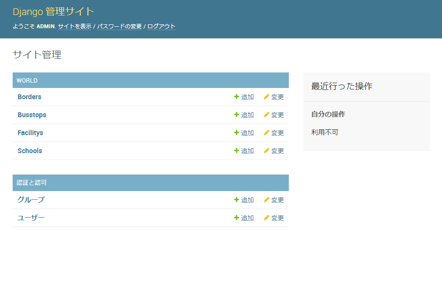
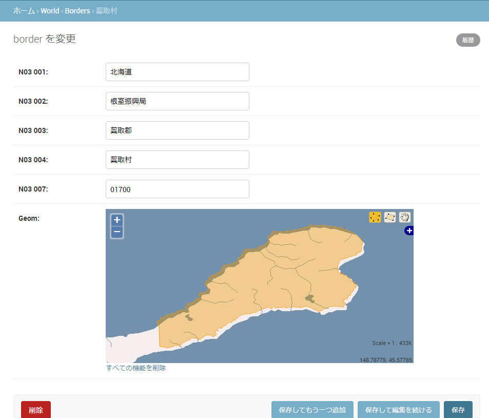
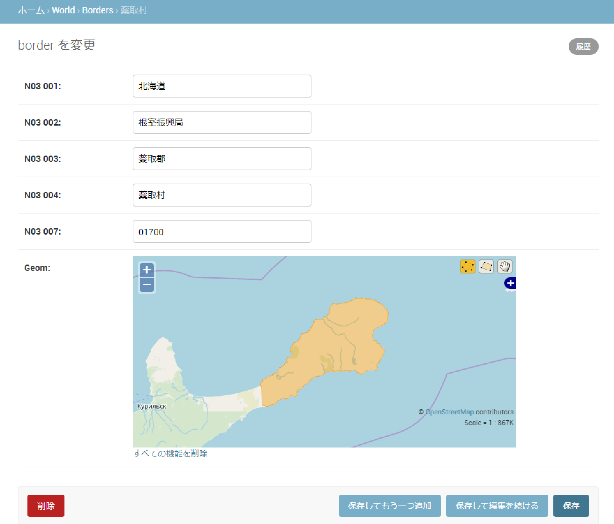
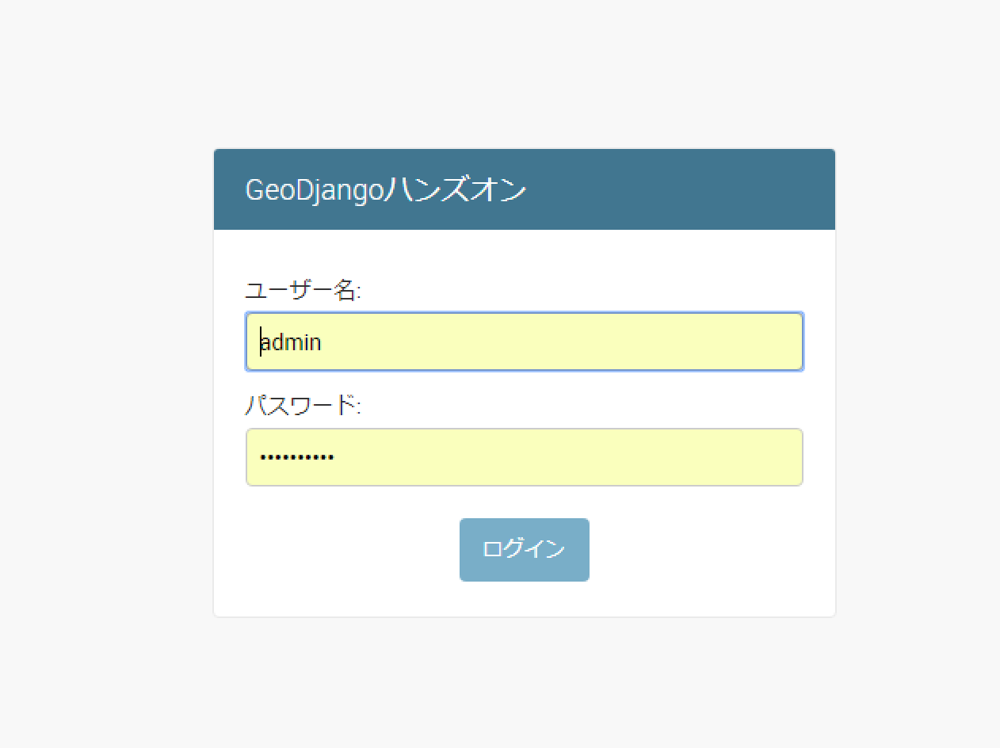
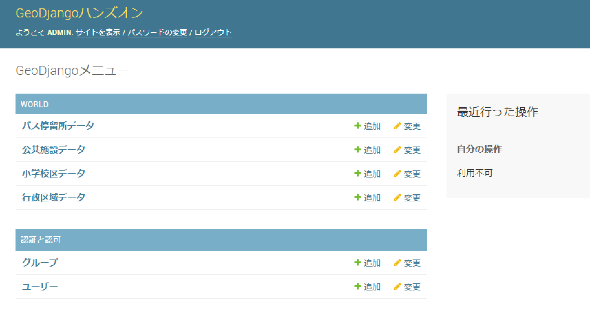

# PostGISへデータインポート

テスト用のGeoJSONファイルをPostGISにインポートします。

## 使用データ

国土数値情報　ダウンロードサービス - <http://nlftp.mlit.go.jp/ksj/index.html>の北海道のデータを使用します

* 国土交通省国土政策局「国土数値情報（行政区域データ）」 (N03-170101_01_GML)
    - <http://nlftp.mlit.go.jp/ksj/gml/datalist/KsjTmplt-N03-v2_3.html>
* 国土交通省国土政策局「国土数値情報（小学校区データ）」 (A27-16_01_GML)
    - <http://nlftp.mlit.go.jp/ksj/gml/datalist/KsjTmplt-A27-v2_1.html>
* 国土交通省国土政策局「国土数値情報（公共施設データ）」 (P02-06_01_GML)
    - <http://nlftp.mlit.go.jp/ksj/gml/datalist/KsjTmplt-P02-v4_0.html>
* 国土交通省国土政策局「国土数値情報（バス停留所データ）」 (P11-10_01_GML)
    - <http://nlftp.mlit.go.jp/ksj/gml/datalist/KsjTmplt-P11.html>

<u>**利用約款**</u>
国土数値情報利用約款 - http://nlftp.mlit.go.jp/ksj/other/yakkan.html

#### GeoJSONに変換をしたファイルの大きさ

* 国土数値情報　行政区域データ (hokkaido.geojson (63.4MB)
* 国土数値情報　小学校区データ (elementary_school.geojson (196KB))
* 国土数値情報　公共施設データ (public_facility.geojson (3.3MB))
* 国土数値情報　バス停留所データ (busstop.geojson (13.9MB))

##### 一括データダウンロード
* [国土数値情報データ ダウンロード (Shapefile)](https://github.com/homata/geodjango-book/blob/masterdownload/shapefile.zip)
* [国土数値情報データ ダウンロード (geojson)](https://github.com/homata/geodjango-book/blob/masterdownload/geojson.zip)

## GeoJSONデータのモデル構造を調べる

Modelクラスを定義するために、GeoJSONデータの内容を調べてる必要があります。
手動でも構造は調べられますが、管理コマンドの「ogrinspect」を利用して自動で構造を調べます。
ogrinspectコマンドはデータファイルを解析して、モデルで定義出来る形式に自動生成してコンソールに出力します。

ogrinspectコマンド<br>
$ python manage.py ogrinspect <データファイル> <モデル名>

行政区域データ
```python
(env) $ python manage.py ogrinspect --srid=4326 hokkaido.geojson Border
# This is an auto-generated Django model module created by ogrinspect.
from django.contrib.gis.db import models

class Border(models.Model):
    n03_001 = models.CharField(max_length=0)
    n03_002 = models.CharField(max_length=0)
    n03_003 = models.CharField(max_length=0)
    n03_004 = models.CharField(max_length=0)
    n03_007 = models.CharField(max_length=0)
    geom = models.PolygonField(srid=4326)
```

小学校区データ
```python
(env) $ python manage.py ogrinspect --srid=4326 elementary_school.geojson School
# This is an auto-generated Django model module created by ogrinspect.
from django.contrib.gis.db import models

class School(models.Model):
    a27_001 = models.CharField(max_length=0)
    a27_002 = models.CharField(max_length=0)
    a27_003 = models.CharField(max_length=0)
    a27_004 = models.CharField(max_length=0)
    geom = models.PointField(srid=4326)
```

公共施設データ
```python
(env) $ python manage.py ogrinspect --srid=4326 public_facility.geojson Facility
# This is an auto-generated Django model module created by ogrinspect.
from django.contrib.gis.db import models

class Facility(models.Model):
    p02_001 = models.CharField(max_length=0)
    p02_002 = models.CharField(max_length=0)
    p02_003 = models.CharField(max_length=0)
    p02_004 = models.CharField(max_length=0)
    p02_005 = models.CharField(max_length=0)
    p02_006 = models.CharField(max_length=0)
    p02_007 = models.CharField(max_length=0)
    geom = models.PointField(srid=4326)
```

バス停留所データ
```python
(env) $ python manage.py ogrinspect --srid=4326 busstop.geojson Busstop
# This is an auto-generated Django model module created by ogrinspect.
from django.contrib.gis.db import models

    class Busstop(models.Model):
    p11_001 = models.CharField(max_length=0)
    p11_002 = models.CharField(max_length=0)
    p11_003_1 = models.CharField(max_length=0)
    p11_003_2 = models.CharField(max_length=0)
    p11_003_3 = models.CharField(max_length=0)
    p11_003_4 = models.CharField(max_length=0)
    p11_003_5 = models.CharField(max_length=0)
    p11_003_6 = models.CharField(max_length=0)
    p11_003_7 = models.CharField(max_length=0)
    p11_003_8 = models.CharField(max_length=0)
    p11_003_9 = models.CharField(max_length=0)
    p11_003_10 = models.CharField(max_length=0)
    p11_003_11 = models.CharField(max_length=0)
    p11_003_12 = models.CharField(max_length=0)
    p11_003_13 = models.CharField(max_length=0)
    p11_003_14 = models.CharField(max_length=0)
    p11_003_15 = models.CharField(max_length=0)
    p11_003_16 = models.CharField(max_length=0)
    p11_003_17 = models.CharField(max_length=0)
    p11_003_18 = models.CharField(max_length=0)
    p11_003_19 = models.CharField(max_length=0)
    p11_004_1 = models.CharField(max_length=0)
    p11_004_2 = models.CharField(max_length=0)
    p11_004_3 = models.CharField(max_length=0)
    p11_004_4 = models.CharField(max_length=0)
    p11_004_5 = models.CharField(max_length=0)
    p11_004_6 = models.CharField(max_length=0)
    p11_004_7 = models.CharField(max_length=0)
    p11_004_8 = models.CharField(max_length=0)
    p11_004_9 = models.CharField(max_length=0)
    p11_004_10 = models.CharField(max_length=0)
    p11_004_11 = models.CharField(max_length=0)
    p11_004_12 = models.CharField(max_length=0)
    p11_004_13 = models.CharField(max_length=0)
    p11_004_14 = models.CharField(max_length=0)
    p11_004_15 = models.CharField(max_length=0)
    p11_004_16 = models.CharField(max_length=0)
    p11_004_17 = models.CharField(max_length=0)
    p11_004_18 = models.CharField(max_length=0)
    p11_004_19 = models.CharField(max_length=0)
    geom = models.PointField(srid=4326)
```

<u>**Note**</u>
* コマンドパラメータは「$ python manage.py ogrinspect --help」を入力するとヘルプが表示されます。

## GeoJSONデータのモデル定義

worldアプリケーションのmodels.pyに、GeoJSONの定義でを記述します。

* __str__() にクラスの名称文字列を定義
* CharFieldの長さが「max_length=0」になっているので「max_length=50〜256」に変更。シェープファイルではmax_lengthが出力されるがGeoJSONの場合出力されない

```python
(env)$ vi world/models.py
# This is an auto-generated Django model module created by ogrinspect.
from django.contrib.gis.db import models

class Border(models.Model):
    n03_001 = models.CharField(max_length=50)
    n03_002 = models.CharField(max_length=50)
    n03_003 = models.CharField(max_length=50)
    n03_004 = models.CharField(max_length=50)
    n03_007 = models.CharField(max_length=50)
    geom = models.PolygonField(srid=4326)

    def __str__(self):
        return self.n03_004

class School(models.Model):
    a27_001 = models.CharField(max_length=50)
    a27_002 = models.CharField(max_length=50)
    a27_003 = models.CharField(max_length=50)
    a27_004 = models.CharField(max_length=50)
    geom = models.PointField(srid=4326)

    def __str__(self):
        return self.a27_003
 
class Facility(models.Model):
    p02_001 = models.CharField(max_length=50)
    p02_002 = models.CharField(max_length=50)
    p02_003 = models.CharField(max_length=50)
    p02_004 = models.CharField(max_length=50)
    p02_005 = models.CharField(max_length=50)
    p02_006 = models.CharField(max_length=50)
    p02_007 = models.CharField(max_length=50)
    geom = models.PointField(srid=4326)

    def __str__(self):
        return self.p02_004

class Busstop(models.Model):
    p11_001 = models.CharField(max_length=256)
    p11_002 = models.CharField(max_length=256)
    p11_003_1 = models.CharField(max_length=256)
    p11_003_2 = models.CharField(max_length=256)
    p11_003_3 = models.CharField(max_length=256)
    p11_003_4 = models.CharField(max_length=256)
    p11_003_5 = models.CharField(max_length=256)
    p11_003_6 = models.CharField(max_length=256)
    p11_003_7 = models.CharField(max_length=256)
    p11_003_8 = models.CharField(max_length=256)
    p11_003_9 = models.CharField(max_length=256)
    p11_003_10 = models.CharField(max_length=256)
    p11_003_11 = models.CharField(max_length=256)
    p11_003_12 = models.CharField(max_length=256)
    p11_003_13 = models.CharField(max_length=256)
    p11_003_14 = models.CharField(max_length=256)
    p11_003_15 = models.CharField(max_length=256)
    p11_003_16 = models.CharField(max_length=256)
    p11_003_17 = models.CharField(max_length=256)
    p11_003_18 = models.CharField(max_length=256)
    p11_003_19 = models.CharField(max_length=256)
    p11_004_1 = models.CharField(max_length=256)
    p11_004_2 = models.CharField(max_length=256)
    p11_004_3 = models.CharField(max_length=256)
    p11_004_4 = models.CharField(max_length=256)
    p11_004_5 = models.CharField(max_length=256)
    p11_004_6 = models.CharField(max_length=256)
    p11_004_7 = models.CharField(max_length=256)
    p11_004_8 = models.CharField(max_length=256)
    p11_004_9 = models.CharField(max_length=256)
    p11_004_10 = models.CharField(max_length=256)
    p11_004_11 = models.CharField(max_length=256)
    p11_004_12 = models.CharField(max_length=256)
    p11_004_13 = models.CharField(max_length=256)
    p11_004_14 = models.CharField(max_length=256)
    p11_004_15 = models.CharField(max_length=256)
    p11_004_16 = models.CharField(max_length=256)
    p11_004_17 = models.CharField(max_length=256)
    p11_004_18 = models.CharField(max_length=256)
    p11_004_19 = models.CharField(max_length=256)
    geom = models.PointField(srid=4326)

    def __str__(self):
        return self.p11_001
```

## モデルのマイグレーションファイルを作成

データベースの更新をするために、マイグレーションファイルを作成します。
makemigrationsは、モデルの変更内容をデータベースに反映するための命令ファイルを作成します。

データベースのマイグレーションファイル作成<br>
$ python manage.py makemigrations

```python
(env) $ python manage.py makemigrations
Migrations for 'world':
world\migrations\0001_initial.py
    - Create model Border
    - Create model Busstop
    - Create model Facility
    - Create model School
```

## データベースのテーブル更新

データベースのテーブルを更新します。
migrateは、モデルの変更内容をデータベースに反映します。

データベースのマイグレーション<br>
$ python manage.py migrate

```python
(env) $ python manage.py migrate
Operations to perform:
Apply all migrations: admin, auth, contenttypes, sessions, world
Running migrations:
Applying world.0001_initial... OK
```


## データインポート

GeoJSONファイルのデータをインポートをするスクリプトファイルを作成し、これを実行してデータをインポートします。
インポートにはユーティリティのdjango.contrib.gis.utils.LayerMappingを利用します。

<u>**Note**</u><br>
GDALのコマンドラインユーティリティを利用してインポートすることも出来ます。
* ogr2ogr: GDALのコマンドラインユーティリティ
* shp2pgsql: ESRI shapefile用のユーティリティ

### 行政区域データ

行政区域データのインポートスクリプトを作成します
　
```python
(env) $ vi world/load_hokkaido.py
# -*- coding: utf-8 -*-
import os
from django.contrib.gis.utils import LayerMapping
from world.models import Border

# Modelとファイルのカラムのマッピング
mapping = {
    'n03_001' : 'N03_001',
    'n03_002' : 'N03_002',
    'n03_003' : 'N03_003',
    'n03_004' : 'N03_004',
    'n03_007' : 'N03_007',
    'geom' : 'POLYGON',
}

# ファイルパス
geojson_file = os.path.abspath(os.path.join(os.path.dirname(__file__), 'data', 'hokkaido.geojson'))

# 実行
def run(verbose=True):
    lm = LayerMapping(Border, geojson_file, mapping, transform=False, encoding='UTF-8')
    lm.save(strict=True, verbose=verbose)
```

Djangoのシェルを起動して、ここからインポートスクリプトを実行します。

```python
(env) $ python manage.py shell
>>> from world import load_hokkaido
>>> load_hokkaido.run()
    ：
Saved: 小樽市
Saved: 小樽市
    ：
    >>> exit()
```

### 小学校区データ

小学校区データのインポートスクリプトを作成します

```python
(env) $ vi world/load_elementary_school.py
# -*- coding: utf-8 -*-
import os
from django.contrib.gis.utils import LayerMapping
from world.models import School

# Modelとファイルのカラムのマッピング
mapping = {
    'a27_001' : 'A27_001',
    'a27_002' : 'A27_002',
    'a27_003' : 'A27_003',
    'a27_004' : 'A27_004',
    'geom'    : 'POINT',
}

# ファイルパス
geojson_file = os.path.abspath(os.path.join(os.path.dirname(__file__), 'data', 'elementary_school.geojson'))

# 実行
def run(verbose=True):
    lm = LayerMapping(School, geojson_file, mapping, transform=False, encoding='UTF-8')
    lm.save(strict=True, verbose=verbose)
```

Djangoのシェルを起動して、ここからインポートスクリプトを実行します。

```python
(env) $ python manage.py shell
>>> from world import load_elementary_school
>>> load_elementary_school.run()
Saved: 大船小学校
Saved: 高盛小学校
    ：
>>> exit()
```

### 公共施設データ

公共施設データのインポートスクリプトを作成します

```python
(env) $ vi world/load_public_facility.py
# -*- coding: utf-8 -*-
import os
from django.contrib.gis.utils import LayerMapping
from world.models import Facility

# Modelとファイルのカラムのマッピング
mapping = {
    'p02_001' : 'P02_001',
    'p02_002' : 'P02_002',
    'p02_003' : 'P02_003',
    'p02_004' : 'P02_004',
    'p02_005' : 'P02_005',
    'p02_006' : 'P02_006',
    'p02_007' : 'P02_007',
    'geom'    : 'POINT',
}

# ファイルパス
geojson_file = os.path.abspath(os.path.join(os.path.dirname(__file__), 'data', 'public_facility.geojson'))

# 実行
def run(verbose=True):
    lm = LayerMapping(Facility, geojson_file, mapping, transform=False, encoding='UTF-8')
    lm.save(strict=True, verbose=verbose)
```

Djangoのシェルを起動して、ここからインポートスクリプトを実行します。

```python
(env) $ python manage.py shell
>>> from world import load_public_facility
>>> load_public_facility.run()
    ：
Saved: 森町消防本部
Saved: 八雲町消防本部
    ：
>>> exit()
```

### バス停留所データ

バス停留所データのインポートスクリプトを作成します

```python
(env) $ vi world/load_busstop.py
# -*- coding: utf-8 -*-
import os
from django.contrib.gis.utils import LayerMapping
from world.models import Busstop

# Modelとファイルのカラムのマッピング
mapping = {
    'p11_001' : 'P11_001' ,
    'p11_002' : 'P11_002',
    'p11_003_1' : 'P11_003_1',
    'p11_003_2' : 'P11_003_2',
    'p11_003_3' : 'P11_003_3',
    'p11_003_4' : 'P11_003_4',
    'p11_003_5' : 'P11_003_5',
    'p11_003_6' : 'P11_003_6',
    'p11_003_7' : 'P11_003_7',
    'p11_003_8' : 'P11_003_8',
    'p11_003_9' : 'P11_003_9',
    'p11_003_10' : 'P11_003_10',
    'p11_003_11' : 'P11_003_11',
    'p11_003_12' : 'P11_003_12',
    'p11_003_13' : 'P11_003_13',
    'p11_003_14' : 'P11_003_14',
    'p11_003_15' : 'P11_003_15',
    'p11_003_16' : 'P11_003_16',
    'p11_003_17' : 'P11_003_17',
    'p11_003_18' : 'P11_003_18',
    'p11_003_19' : 'P11_003_19',
    'p11_004_1' : 'P11_004_1',
    'p11_004_2' : 'P11_004_2',
    'p11_004_3' : 'P11_004_3',
    'p11_004_4' : 'P11_004_4',
    'p11_004_5' : 'P11_004_5',
    'p11_004_6' : 'P11_004_6',
    'p11_004_7' : 'P11_004_7',
    'p11_004_8' : 'P11_004_8',
    'p11_004_9' : 'P11_004_9',
    'p11_004_10' : 'P11_004_10',
    'p11_004_11' : 'P11_004_11',
    'p11_004_12' : 'P11_004_12',
    'p11_004_13' : 'P11_004_13',
    'p11_004_14' : 'P11_004_14',
    'p11_004_15' : 'P11_004_15',
    'p11_004_16' : 'P11_004_16',
    'p11_004_17' : 'P11_004_17',
    'p11_004_18' : 'P11_004_18',
    'p11_004_19' : 'P11_004_19',
    'geom'    : 'POINT',
}

# ファイルパス
geojson_file = os.path.abspath(os.path.join(os.path.dirname(__file__), 'data', 'busstop.geojson'))

# 実行
def run(verbose=True):
    lm = LayerMapping(Busstop, geojson_file, mapping, transform=False, encoding='UTF-8')
    lm.save(strict=True, verbose=verbose)
```

Djangoのシェルを起動して、ここからインポートスクリプトを実行します。

```python
(env) $ python manage.py shell
>>> from world import load_busstop
>>> load_busstop.run()
    ：
Saved: 農協入口
Saved: 幕別南町
    ：
>>> exit()
```

## 管理画面の設定変更

管理画面でマップ表示するように変更をします.

### geomフィールドをマップ表示

geomフィールドをマップ表示するように変更します。 (powered by OpenLayers)<br>
worldアプリケーションの管理画面の設定を変更します。

```python
(env) $ vi world/admin.py
from django.contrib.gis import admin
from world.models import Border, School, Facility, Busstop

admin.site.register(Border, admin.GeoModelAdmin)
admin.site.register(School, admin.GeoModelAdmin)
admin.site.register(Facility, admin.GeoModelAdmin)
admin.site.register(Busstop, admin.GeoModelAdmin)
```

URL.confの参照モジュールをGISモジュールに変更します。

```python
(env) $ vi geodjango/urls.py
from django.contrib import admin
  ↓
from django.contrib.gis import admin
```

Webサーバを起動します。

```python
(env) $ python manage.py runserver
```

ブラウザからURL: http://127.0.0.1:8000/admin にアクセスし、ログインした後に表示を確認します。

テーブル一覧が表示されているのを確認します

<div align="center" style="margin-bottom:50px;margin-top:30px">
    
</div>

項目を選択して、geomフィールドがマップ表示されているのを確認します

<div align="center" style="margin-bottom:50px;margin-top:30px">
    
</div>

### geomフィールドをOpenStreetMapで表示

背景地図をOpenStreetMapに変更する為に、worldアプリの管理画面の設定を変更します。

```python
(env) $ vi world/admin.py
変更前
admin.site.register(Border, admin.GeoModelAdmin)
admin.site.register(School, admin.GeoModelAdmin)
admin.site.register(Facility, admin.GeoModelAdmin)
admin.site.register(Busstop, admin.GeoModelAdmin)
  ↓
変更後
admin.site.register(Border, admin.OSMGeoAdmin)
admin.site.register(School, admin.OSMGeoAdmin)
admin.site.register(Facility, admin.OSMGeoAdmin)
admin.site.register(Busstop, admin.OSMGeoAdmin)
```

OpenStreetMapでマップが表示されているのを確認します

<div align="center" style="margin-bottom:50px;margin-top:30px">
    
</div>

## django-leafletで管理画面のマップを表示

管理画面のマップをdjango-leafletで表示をします。

django-leafletをインストール
```python
(env) $ pip install django-leaflet
```

設定ファイルに追加
```python
(env) $ vi geodjango/settings.py
INSTALLED_APPS = [
    :
    'leaflet',
]
```

管理画面設定ファイルを変更
```python
(env) $ vi world/admin.py
変更前
admin.site.register(Border, admin.OSMGeoAdmin)
admin.site.register(School, admin.OSMGeoAdmin)
admin.site.register(Facility, admin.OSMGeoAdmin)
admin.site.register(Busstop, admin.OSMGeoAdmin)
  ↓
変更後
from leaflet.admin import LeafletGeoAdmin

class BorderAdmin(LeafletGeoAdmin):
  search_fields = ['n03_001','n03_003','n03_004']
  list_filter = ('n03_003')

admin.site.register(Border, BorderAdmin)
admin.site.register(School, LeafletGeoAdmin)
admin.site.register(Facility, LeafletGeoAdmin)
admin.site.register(Busstop, LeafletGeoAdmin)
```
LeafletGeoAdminを登録します。<br>

LeafletGeoAdminを継承したBorderAdminクラスを定義しこれを登録することで、検索・フィルタ機能の追加することが出来ます。
* search_fields: 検索対象
* list_filter: フィールド名がフィルタ対象

<u>**Note**</u>
* django-leafletは管理画面以外にもいろいろな機能がありますので下記を参考にしてみて下さい。
* django-leaflet - https://github.com/makinacorpus/django-leaflet

## 管理画面をタイトルを変更

設定ファイルのsettings.pyの設定で、管理画面のヘッダとタイトルを変更することが出来ます。

タイトル文字列の設定
```python
(env) $ vi geodjango/settings.py
from django.contrib.gis import admin

admin.site.site_title  = 'GeoDjangoログイン'
admin.site.site_header = 'GeoDjangoハンズオン'
admin.site.index_title = 'GeoDjangoメニュー'
```

worldアプリケーションのモデル定義のクラスにメタクラスを追加すると、管理画面のテーブル名称を見やすい形に変更することが出来ます。
テーブル名称は、単数と複数の2種類を指定出来ます。

モデルのタイトル文字列の設定
```python
(env) $ vi world/modles.py
class Border(models.Model):
    class Meta:
        verbose_name = '行政区域データ'  # オブジェクトの人間が読める名前(単数)小文字でよい
        verbose_name_plural = '行政区域データ'  # オブジェクトの複数の名前 小文字でよい

    n03_001 = models.CharField(max_length=50)
    n03_002 = models.CharField(max_length=50)
    :
    :
```

ログイン画面の例
<div align="center" style="margin-bottom:50px;margin-top:30px">
    
</div>

管理画面のテーブル一覧画面の例
<div align="center" style="margin-bottom:50px;margin-top:30px">
    
</div>
