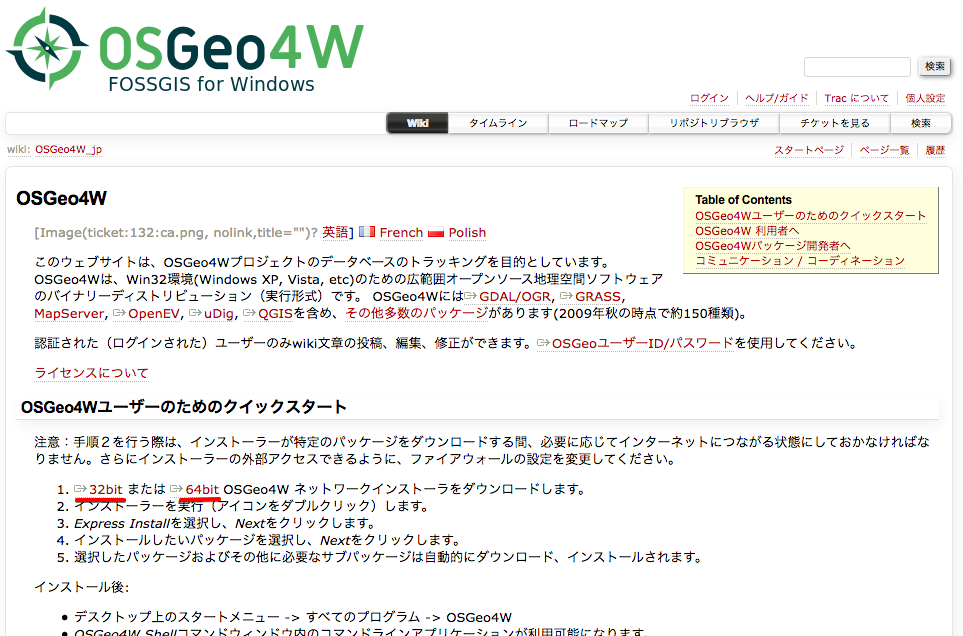
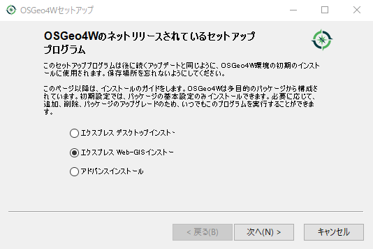
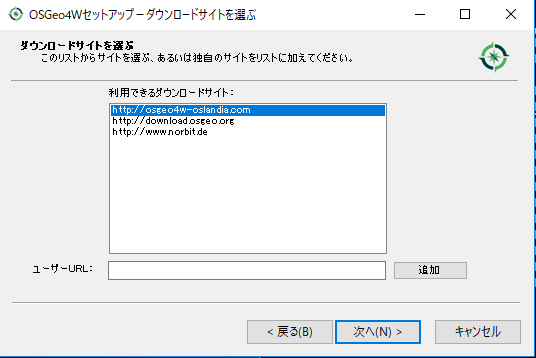
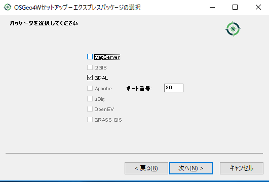
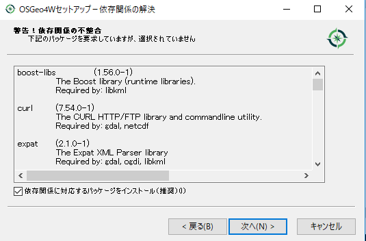
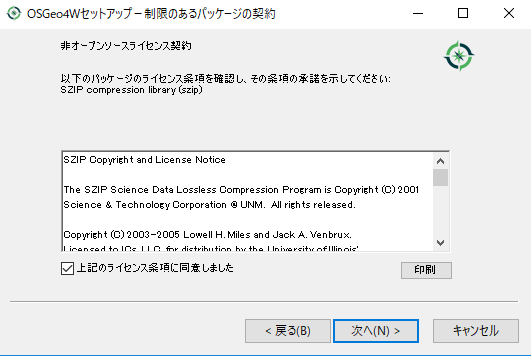
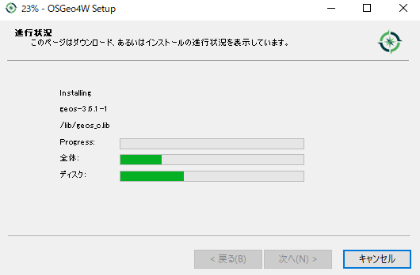
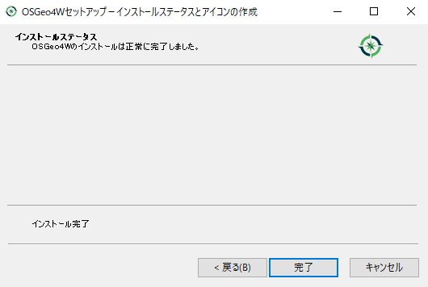

# GeoDjangoのインストール

## GISライブラリインストール (Windowsの場合のみ)

##### OSGeo4Wインストール
GeoDjangoが必要とする、GDAL(Geospatial Data Abstraction Library), GEOS (Geometry Engine, Open Source) ,PROJ4 (Cartographic Projections Library) ライブラリをOSGeo4Wインストーラでインストールしまします

OSGeo4Wインストーラを <https://trac.osgeo.org/osgeo4w/wiki/OSGeo4W_jp> からダウンロードして実行します。 


<div align="center" style="margin-bottom:50px;margin-top:30px">
    
</div>

* 32bitsの場合 - http://download.osgeo.org/osgeo4w/osgeo4w-setup-x86.exe
* 64bitsの場合 - http://download.osgeo.org/osgeo4w/osgeo4w-setup-x86_64.exe


「エクスプレス Web-GIS インストール」を選択して「次へ」をクリック
<div align="center" style="margin-bottom:50px;margin-top:30px">
    
</div>

ダウンロードサイトは「http://osgeo4w-oslandia.com」を選択して「次へ」をクリック
<div align="center" style="margin-bottom:50px;margin-top:30px">
    
</div>

[パッケージの選択]リストで、[GDAL]のみを選択。MapServer等の他に選択肢を外して「次へ」をクリック
<div align="center" style="margin-bottom:50px;margin-top:30px">
    
</div>

「依存関係に対応するパッケージをインストール（推奨）」をチェックして、「次へ」をクリック
<div align="center" style="margin-bottom:50px;margin-top:30px">
    
</div>

「上記のライセンス条項に同意しました」をチェックして、「次へ」をクリック
<div align="center" style="margin-bottom:50px;margin-top:30px">
    
</div>

パッケージが自動的にダウンロードされ、インストールされます。
<div align="center" style="margin-bottom:50px;margin-top:30px">
    
</div>

インストールが終わったら「完了」をクリックして終了します。
<div align="center" style="margin-bottom:50px;margin-top:30px">
    
</div>


#### 環境変数設定

GeoDjangoを使用するには、OSGeo4WのディレクトリをWindowsシステムのPathに追加し、GDAL_DATAとPROJ_LIB環境変数を作成する必要があります。 
コマンドプロンプトを実行して下記を設定します。

```shell
set POSTGRES_ROOT=C:\Program Files\PostgreSQL\9.6\bin
set OSGEO4W_ROOT=C:\OSGeo4W64
set GDAL_LIBRARY_PATH=C:\OSGeo4W64\bin
set GDAL_DATA=%OSGEO4W_ROOT%\share\gdal
set PROJ_LIB=%OSGEO4W_ROOT%\share\proj
set PATH=%OSGEO4W_ROOT%\bin;%POSTGRES_ROOT%;%PATH%;
```

<u>**Note**</u>
* コマンドプロンプトのウィンドウを閉じると設定が無効になるます。
* コマンドプロンプトを起動するたびに設定する必要がありますので、batファイルを作成しておくことをお勧めします。
* 毎回設定するのが大変な場合は、システムの環境変数に設定をすると良いです

batファイルの例
```shell
$ vi env.bat
@echo off
set POSTGRES_ROOT=C:\Program Files\PostgreSQL\9.6\bin
set OSGEO4W_ROOT=C:\OSGeo4W64
set GDAL_LIBRARY_PATH=C:\OSGeo4W64\bin
set GDAL_DATA=%OSGEO4W_ROOT%\share\gdal
set PROJ_LIB=%OSGEO4W_ROOT%\share\proj
set PATH=%OSGEO4W_ROOT%\bin;%POSTGRES_ROOT%;%PATH%;
```

#### sqlite3.dllのコンフリクト

* GeoDjango on Windows: Try setting GDAL_LIBRARY_PATH in your settings
    - https://stackoverflow.com/questions/44140241/geodjango-on-windows-try-setting-gdal-library-path-in-your-settings

OSGeo4Wインストーラでgdalライブラリをインストールすると、Pythonのsqlite3.dllと同名のファイルがインストールされてエラーが発生する場合があります。
エラーになったら、Python側のenv¥Scripts¥sqlite3.dllの名前を変更して重複を避けてください

```shell
C:¥> ren env¥Scripts¥sqlite3.dll 000.sqlite3.dll 
 
C:¥> dir env¥Scripts¥000.sqlite3.dll
ドライブ C のボリューム ラベルがありません。
ボリューム シリアル番号は 72DC-FA37 です
C:\Users\xxxx\Documents\geodjango\env\Scripts のディレクトリ
2018/06/12  15:08         1,153,176 000.sqlite3.dll
            1 個のファイル           1,153,176 バイト
            0 個のディレクトリ  89,404,837,888 バイトの空き領域
```


## PostGISのデータベースを作成

PostGISのデータベースを作成します。データベースは「geodjangodb」とい名前で作成します。

データベース作成
```shell
(env) $ createdb -U postgres -E UTF-8 geodjangodb
パスワード:
```

PostGISのエクステンションを作成
```shell
(env) $ psql -U postgres -d geodjangodb -c "CREATE EXTENSION postgis;"
ユーザ postgres のパスワード:
CREATE EXTENSION
```

エクステンションの確認
```shell
(env) $ psql -U postgres -d geodjangodb -c "select * from pg_available_extensions;"
ユーザ postgres のパスワード:
name | default_version | installed_version | comment
--------+--------------+-------------------+------------------------------
　　   :
postgis | 2.3.7        | 2.3.7             | PostGIS geometry, geography, and raster spatial types and functions
```

データベースの確認
```shell
(env) $ psql -U postgres -l
ユーザ postgres のパスワード:
                                            データベース一覧
    名前     |  所有者  | エンコーディング |      照合順序      | Ctype(変換演算子)  |      アクセス権
-------------+----------+------------------+--------------------+--------------------+-----------------------
geodjangodb | postgres | UTF8             | Japanese_Japan.932 | Japanese_Japan.932 |
postgres    | postgres | UTF8             | Japanese_Japan.932 | Japanese_Japan.932 |
template0   | postgres | UTF8             | Japanese_Japan.932 | Japanese_Japan.932 | =c/postgres          +
            |          |                  |                    |                    | postgres=CTc/postgres
template1   | postgres | UTF8             | Japanese_Japan.932 | Japanese_Japan.932 | =c/postgres          +
            |          |                  |                    |                    | postgres=CTc/postgres
(4 行)
```

## アプリケーション作成

マップ表示をするアプリケーションの作成をします。

アプリケーション作成コマンド<br>
$ python manage.py startapp <アプリケーション名>

```shell
(env) $ python manage.py startapp world
```

ファイル構成

    geodjango           <-- プロジェクトのルート
    ├── manage.py       <-- プロジェクトの管理用のスクリプト
    ├── geodjango       <-- プロジェクト設定
    │   ├── __init__.py     <-- Pythonの初期化パッケージファイル
    │   ├── settings.py     <-- プロジェクトの設定ファイル
    │   ├── urls.py         <-- プロジェクトのURLパターン設定ファイル
    │   └── wsgi.py         <-- プロジェクトのWSGI(ウィズギー)インターフェース設定ファイル
    └── world           <-- アプリケーションディレクトリ
        ├── __init__.py     <-- Pythonの初期化パッケージファイル
        ├── admin.py        <-- 管理サイトの設定ファイル
        ├── apps.py         <-- アプリケーションの設定ファイル
        ├── migrations      <-- データベースのマイグレーションファイル
        │   └── __init__.py <-- Pythonの初期化パッケージファイル
        ├── models.py       <-- モデル定義のファイル
        ├── tests.py        <-- テストの記述するファイル
        └── views.py        <-- ビューを記述するファイル

## psycopg2をインストール

psycopg2 Pythonモジュールは、PythonとPostgreSQLデータベース間のインタフェースライブラリです。
下記のどちらかをインストールします。

コンパイルバージョン
```python
(env) $ pip install psycopg2
```

バイナリーバージョン
```python
(env) $ pip install psycopg2-binary
    -> psycopg2-binary==2.7.4
```

## データベースとアプリケーションの設定

データベースのENGINEをPostGISに変更とアプリケーションの追加をします。

設定ファイル「geodjango/settings.py」を編集します。
```python
(env) $ vi geodjango/settings.py
# django.contrib.gis.db.backends.postgisに変更
DATABASES = {
    'default': {
        'ENGINE': 'django.contrib.gis.db.backends.postgis',  <-- 変更
        'NAME': 'geodjangodb',  <-- 変更  データベース名
        'USER': 'postgres',     <-- 追加  ユーサ名
        'HOST':'localhost',     <-- 追加  ホスト名
        'PASSWORD': 'xxxxxxxx', <-- 追加  パスワード
    }
}
#'django.contrib.gis'と'world'を追加。
INSTALLED_APPS = (
    'django.contrib.admin',
    'django.contrib.auth',
    'django.contrib.contenttypes',
    'django.contrib.sessions',
    'django.contrib.messages',
    'django.contrib.staticfiles',
    'django.contrib.gis',       <-- 追加
    'world.apps.WorldConfig',   <-- 追加 (obsolete: world)
)
```

PostGISのデータベースにテーブルを作成します。
```shell
(env) $ python manage.py migrate
Operations to perform:
    Apply all migrations: admin, auth, contenttypes, sessions
Running migrations:
    Applying contenttypes.0001_initial... OK
    Applying auth.0001_initial... OK
    Applying admin.0001_initial... OK
    Applying admin.0002_logentry_remove_auto_add... OK
    Applying contenttypes.0002_remove_content_type_name... OK
    Applying auth.0002_alter_permission_name_max_length... OK
    Applying auth.0003_alter_user_email_max_length... OK
    Applying auth.0004_alter_user_username_opts... OK
    Applying auth.0005_alter_user_last_login_null... OK
    Applying auth.0006_require_contenttypes_0002... OK
    Applying auth.0007_alter_validators_add_error_messages... OK
    Applying auth.0008_alter_user_username_max_length... OK
    Applying auth.0009_alter_user_last_name_max_length... OK
    Applying sessions.0001_initial... OK
```

PostGISに管理画面にログイン権限のある管理ユーザのアカウントを作成します。<br>
Webアプリ起動されていたら、CTRL+Cで一旦止めます

管理ユーザのアカウントを作成します
```shell
(env) $ python manage.py createsuperuser
Username (leave blank to use 'xxxxx'): admin
Email address: hoge@fuga.com
Password: xxxxxx
Password (again): xxxxxx
Superuser created successfully.
```
