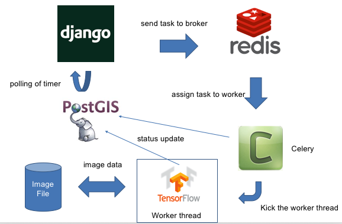

# GeoDjango レシピ

Django/GeoDjangoの開発で役に立つ、ちょっとしたコツを紹介します。

## プロジェクト名と設定ディレクトリ名を違うものにする
プロジェクト名と設定ディレクトリ名が同じ名前でわかりづらいということがあります。
この場合は、django-admin.pyでプロジェクトを作成するときに、設定ディレクトリを
わかりやすいディレクトリ名にするという方法もあります。

通常の場合
```python
(env) $ django-admin.py startproject myproj
myproj
├── manage.py
└── myproj
    ├── __init__.py
    ├── settings.py
    ├── urls.py
    └── wsgi.py
```

設定ディレクトリ名を変更した場合
```python
(env) $ mkdir myproj
(env) $ cd myproj
(env) $ django-admin.py startproject config .
myproj
├── config
│   ├── __init__.py
│   ├── settings.py
│   ├── urls.py
│   └── wsgi.py
└── manage.py
```

## Djangoの環境変数
設定ファイルのsettings.pyにパスワードやAPIキー等を直接に値を記述をすると
GitHub等で管理したソースコードからパスワードが漏洩する恐れがあります。
環境変数ファイルから値を読み込むようにしておくとこれを防ぐことが出来ます。

```python
(env)$ pip install django-environ
```

```python
(env)$ vi .env
# PostgreSQL
POSTGRES_ENGINE=django.db.backends.postgresql_psycopg2
POSTGRES_DATABASE=5952
POSTGRES_USER=postgres
POSTGRES_PASSWORD=
POSTGRES_HOST=127.0.0.1
POSTGRES_PORT=5432
```

```python
(env)$ vi config/settings.py
import environ
root = environ.Path(__file__) - 3
env = environ.Env(DEBUG=(bool, False),)
environ.Env.read_env()

SITE_ROOT = root()

DEBUG = env('DEBUG')
TEMPLATE_DEBUG = DEBUG

# for postgres
DATABASES = {
    'default': {
        'ENGINE': os.environ['POSTGRES_ENGINE'],
        'NAME': os.environ['POSTGRES_DATABASE'],
        'USER': os.environ['POSTGRES_USER'],
        'PASSWORD': os.environ['POSTGRES_PASSWORD'],
        'HOST': os.environ['POSTGRES_HOST'],
        'PORT': os.environ['POSTGRES_PORT']
    }
}
```

## GeoDjangoでGeoJSON Tile Layer
[django-geojson](https://pypi.org/project/django-geojson/)をインストールすると
「Tiled GeoJSON layer view」というViewが利用することが出来ます。

これに、JavaScriptライブラリの[Leaflet GeoJSON Tile Layer](https://github.com/glenrobertson/leaflet-tilelayer-geojson/)を
組み合わせるとGeoJSONをタイルで読み込むことが出来ます。
ただし、Leaflet GeoJSON Tile LayerがLeaflet 0.7.7にしか対応してないこともあるので、紹介までに留めて起きます

[django-geojson document](https://django-geojson.readthedocs.io/en/latest/index.html)には、
他にも機能があるのでドキュメントを参考にしてみてください。

```python
(env)$ pip install django-geojson
```

## Djangoで非同期処理
Djangoで非同期処理をする場合は、分散タスク・キューのCelery - http://www.celeryproject.org/ を使う方法があります。

```python
(env)$ pip install celery
```

例として、TensorFlowを使った非同期処理を下記に記述します。
* task queue based on message - Celery
* used celery as broker - RabbitMQ, Redis 
* Worker Thread of Application - e.g. TensorFlow 

<div align="center" style="margin-bottom:50px;margin-top:30px">
    
</div>

<u>**参考**</u>
* Using Celery with Django - http://docs.celeryproject.org/en/latest/django/first-steps-with-django.html#using-celery-with-django

## SQLでデータベースアクセス
直接にSQL文でデータベースにアクセスすることが出来ます。
複雑な空間演算をする時などでは、SQL文を直接記述する方が良いかと思います。

#### Djangoのモデルとして接続しているデータベースにアクセスする場合

```python
from django.db import connection

try:
    cursor = connection.cursor()
    cursor.execute("SELECT * FROM database")

    col_names = [desc[0] for desc in cursor.description] # カラム名取得

    # fetchall()で、結果を全て取り出せる
    rows = cursor.fetchall()
    dict_result = []
    for row in rows:
        row_dict = dict(zip(col_names, row))
        dict_result.append(row_dict)

except Exception as e:
    raise Exception()

finally:
    cursor.close()

return dict_result
```

#### 外部のデータベースにアクセスする場合

```python
import psycopg2
import psycopg2.extras # DictCursorを使用するために拡張機能をimport

# Connect to an existing database
try:
    connection = psycopg2.connect("dbname='database' user='postgres' host='localhost' password='xxxxx' port='5432'")
    connection.autocommit = True
except psycopg2.Error as e:
    raise Exception()

try:
     # Open a cursor to perform database operations
    cursor = connection.cursor(cursor_factory=psycopg2.extras.DictCursor)
    # Query the database and obtain data as Python objects
    cursor.execute("SELECT * FROM database")

    # fetchall()で、１結果を全て取り出せる
    cursor = cursor.fetchall()
    dict_result = []
    for row in rows:
        dict_result.append(dict(row))

except psycopg2.Error as e:
    raise Exception()

finally:
    cursor.close()
    connection.close()

return dict_result
```

<u>**参考**</u>
* セキュリティの観点から、データベースの接続情報はソースコードに直接に記述をせずに、django-environ等で環境変数で設定することを推奨します。