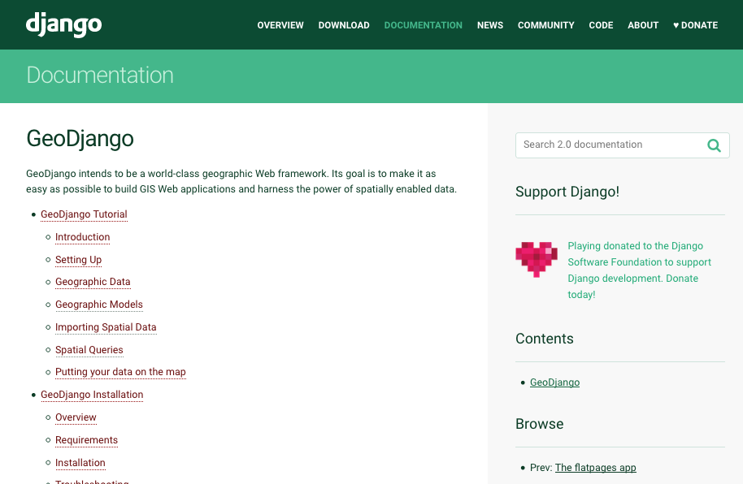
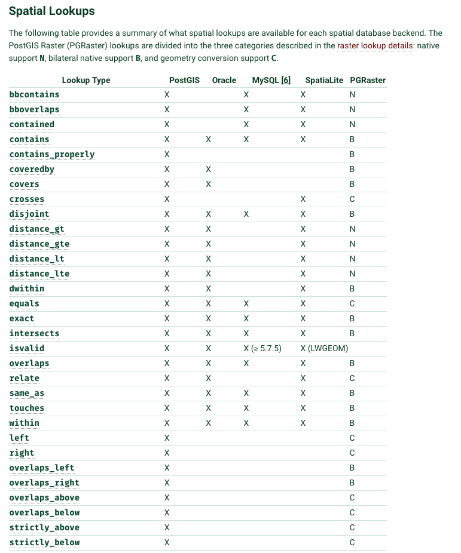
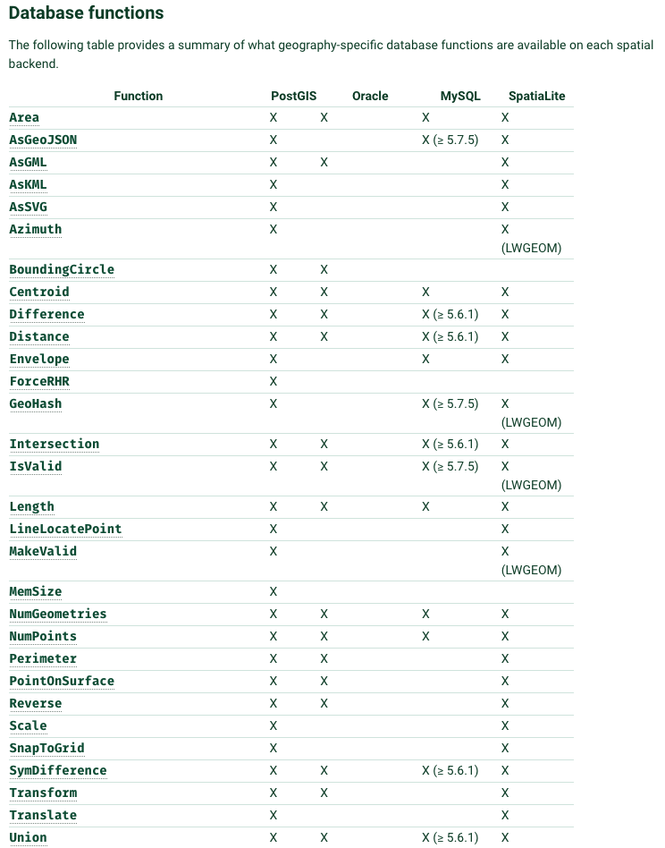
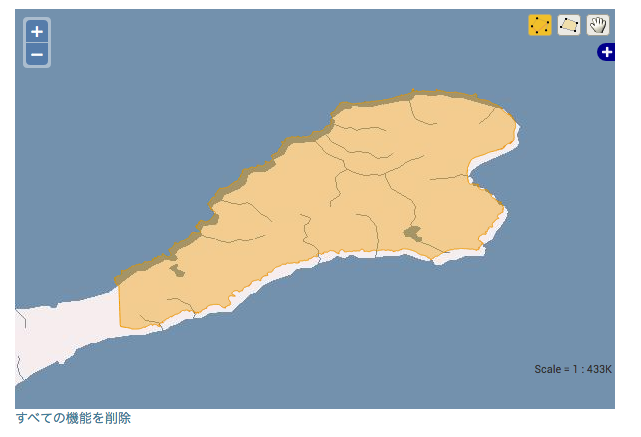
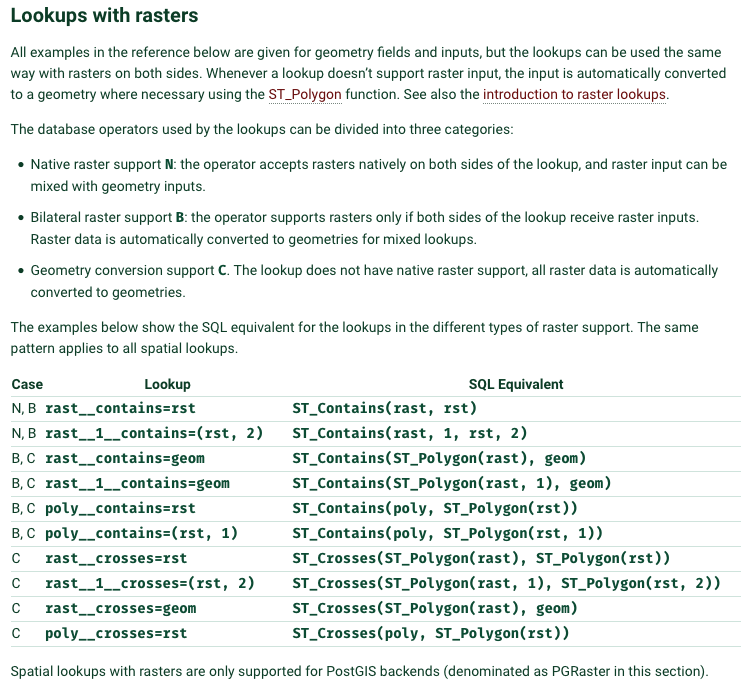
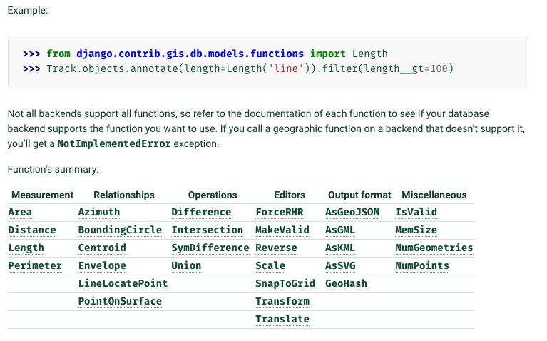
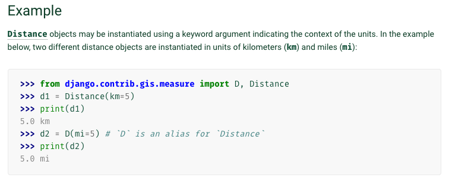
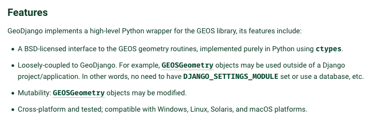
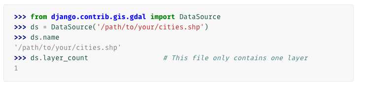
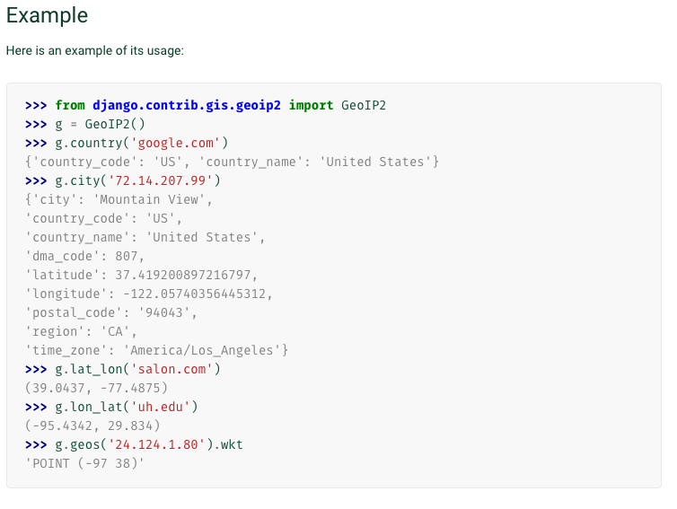

# GeoDjango Tips
GeoDjango - https://docs.djangoproject.com/en/2.0/ref/contrib/gis/

GeoDjangoのドキュメントを元にTipsを説明します。

    

## GeoDjango Model API
GeoDjango Model API - https://docs.djangoproject.com/en/2.0/ref/contrib/gis/model-api/

Djangoのデータモデルに、地理空間データの点・線・面・ラスターのフィールド等を拡張してデータ操作します。
* GeometryField
* PointField
* LineStringField
* PolygonField
* RasterField

## GeoDjango Database API
GeoDjango Database API　- https://docs.djangoproject.com/en/2.0/ref/contrib/gis/db-api/

データベースのバックエンドとして、PostGIS、MySQL、Oracle, SpatiaLiteをサポートし、
空間演算やデータ変換出力等をします。

* django.contrib.gis.db.backends.postgis
* django.contrib.gis.db.backends.mysql
* django.contrib.gis.db.backends.oracle
* django.contrib.gis.db.backends.spatialite

    

Spatial Lookups

    

Database functions

    

## GeoDjango Forms API
GeoDjango Forms API - https://docs.djangoproject.com/en/2.0/ref/contrib/gis/forms-api/#module-django.contrib.gis.forms

マップ表示できるFormやWidgets機能があります。
デフォルトでは、NASAのWMSレイヤーを使用してOpenLayersマップを使用しています。

#### Widget classes
* BaseGeometryWidget
* OpenLayersWidget
* OSMWidget

    

## GIS QuerySet API Reference
GIS QuerySet API Reference - https://docs.djangoproject.com/en/2.0/ref/contrib/gis/geoquerysets/

GeometryFieldとRasterFieldに対してのクエリーを可能にしています。

    

## Geographic Database Functions
Geographic Database Functions - https://docs.djangoproject.com/en/2.0/ref/contrib/gis/functions/

データベースに対しての関数を提供されてます。

    

## Measurement Objects
Measurement Objects - https://docs.djangoproject.com/en/2.0/ref/contrib/gis/measure/

距離と面積の単位を簡単に表現できるオブジェクトです。

    

## GEOS API
GEOS API - https://docs.djangoproject.com/en/2.0/ref/contrib/gis/geos/

GEOSライブラリ(地理空間情報処理のためのオープンソースライブラリ)のPythonラップAPIです。

    

## GDAL API
GDAL API - https://docs.djangoproject.com/en/2.0/ref/contrib/gis/gdal/

GDALライブラリ(ラスタおよびベクトル地理空間データ変換ライブラリ) のPythonラップAPIです。
ベクトル空間データの読み取りと座標変換、ラスタ(画像)データに対するGDALの最小限の機能をサポートしています。

    

## Geolocation with GeoIP2
Geolocation with GeoIP2 - https://docs.djangoproject.com/en/2.0/ref/contrib/gis/geoip2/

MaxMindのgeoip2 Pythonライブラリ https://geoip2.readthedocs.io/en/latest/ のラッパーライブラリです。 
IPアドレスから国と都市名を取得します。

#### 使用データ
GeoLite2 Free Downloadable Databases - https://dev.maxmind.com/geoip/geoip2/geolite2/
* 国 - GeoLite2-Country.mmdb.gz
* 都市 - GeoLite2-City.mmdb.gz 

    

## GeoDjango Utilities
GeoDjango Utilities - https://docs.djangoproject.com/en/2.0/ref/contrib/gis/utils/

* LayerMapping data import utility
    - 空間データをモデルに変換する
* OGR Inspection
    - OGR互換のデータ(シェープファイル等)を検査します
* GeoJSON Serializer
    - GeoJSONのシリアライザー

## GeoDjango Management Commands
GeoDjango Management Commands - https://docs.djangoproject.com/en/2.0/ref/contrib/gis/commands/

管理コマンドを提供します

* inspectdb
    - データテーブルのデータをDjangoモデルフォーマットで出力します
* ogrinspect
    - OGR互換のデータ(シェープファイル等)をDjangoモデルフォーマットで出力します

## GeoDjango’s admin site
GeoDjango’s admin site - https://docs.djangoproject.com/en/2.0/ref/contrib/gis/admin/

管理画面用に地理空間対応管理クラスを提供します。

* GeoModelAdminクラス (OpenLayerベース)
* OSMGeoAdminクラス (OpenStreetMapベース)

## Geographic Feeds
Geographic Feeds - https://docs.djangoproject.com/en/2.0/ref/contrib/gis/feeds/

GeoRSS SimpleまたはW3C Geo標準に従ってフォーマットされたRSS / Atomフィードに位置情報を埋め込むことが出来ます。

* GeoRSS Simple - http://www.georss.org/simple.html
* W3C Geo standards - https://www.w3.org/2003/01/geo/

## Geographic Sitemaps
Geographic Sitemaps - https://docs.djangoproject.com/en/2.0/ref/contrib/gis/sitemaps/

KMLSitemapとKMZSitemapが利用できます。
