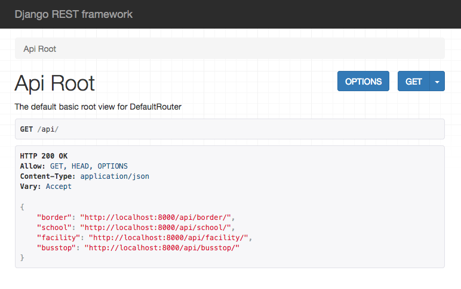
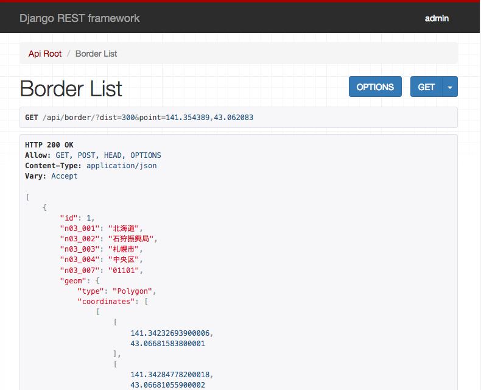
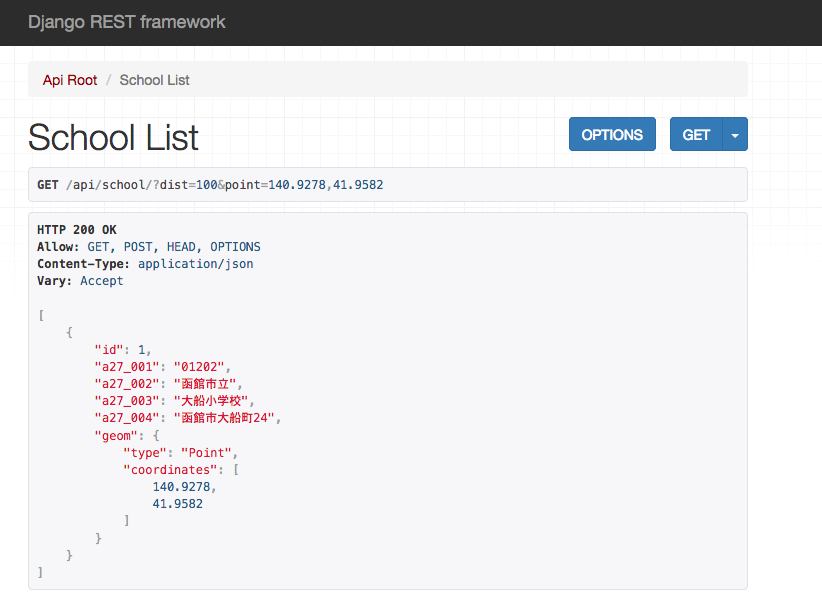
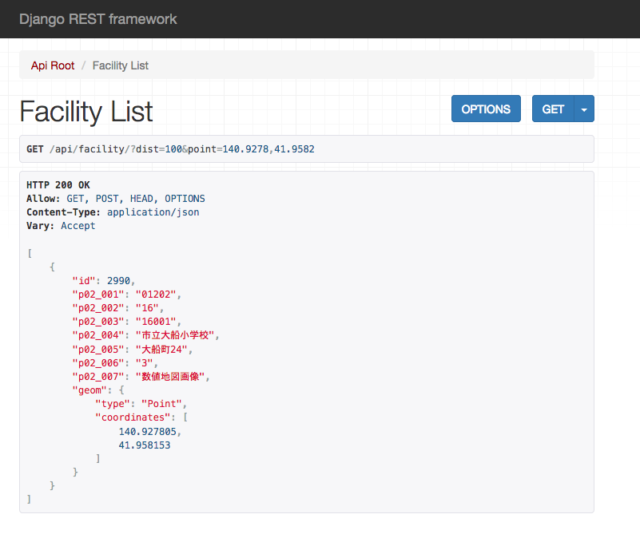
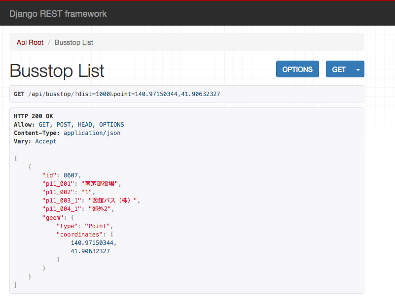
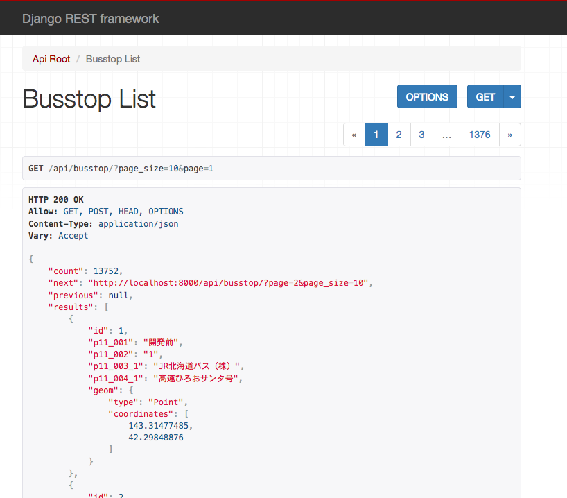
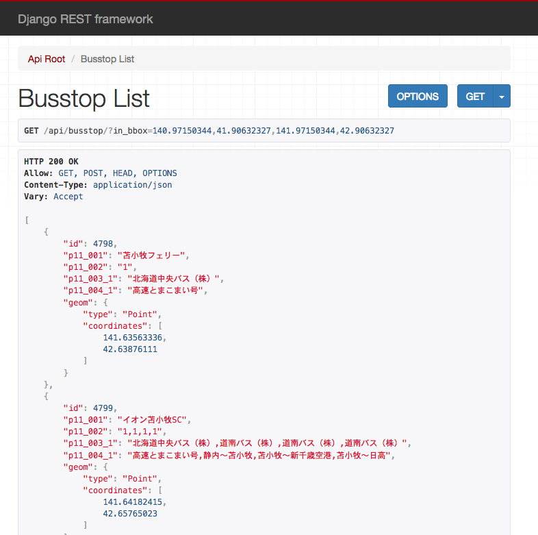
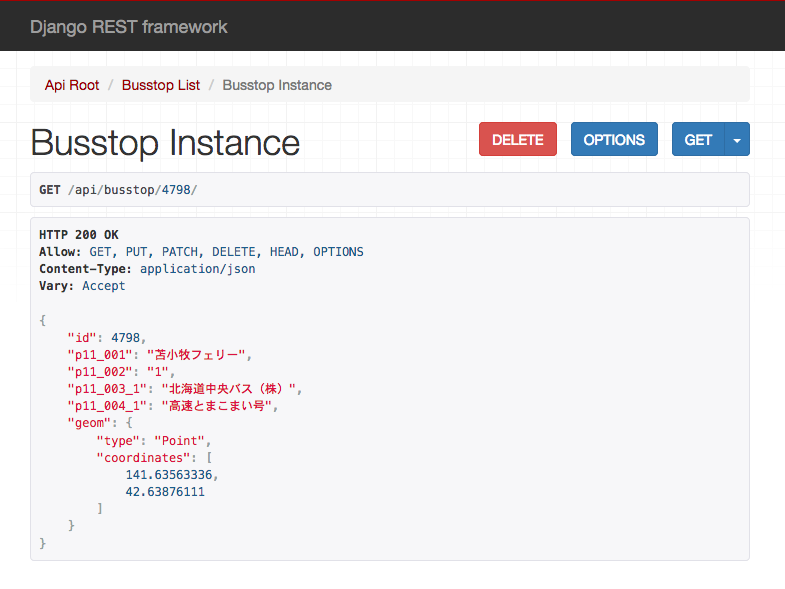
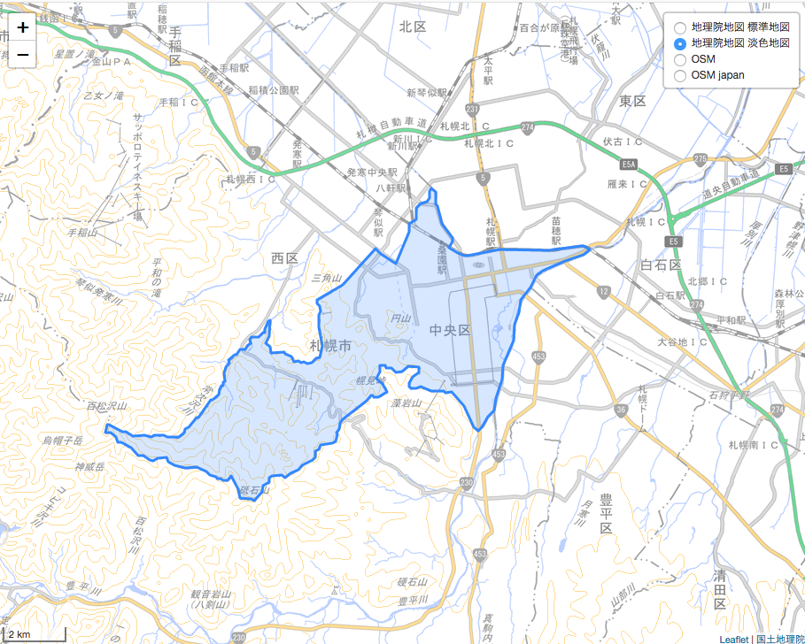
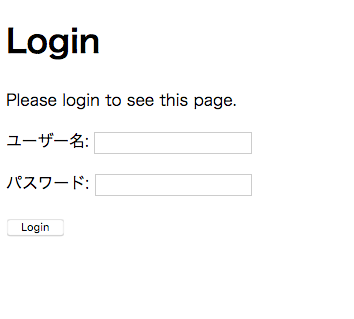

# GeoDjangoのチュートリアル

PostGISに入力したデータを使った処理を作成して行きたいと思います。

## RESTful APIの作成
leaflet.js等のJavaScriptとサーバとのインターフェースとしてRESTful APIを実装します。
DjangoでRESTful APIを実装する為に、Django REST framework(DRF)を使用します。
django-rest-framework-gisは、このDRFに地理空間機能拡張したモジュールです。

pipコマンドを使って追加をします。
* djangorestframework-gis : RESTful APIモジュール Django REST framework(DRF)の地理空間機能拡張バージョン
* django-filter : 検索機能モジュール
* markdown : Markdown変換ライブラリ

```python
(env) $ pip install djangorestframework-gis
(env) $ pip install django-filter   # Filtering support
(env) $ pip install markdown        # Markdown support for the browsable API.
(env) $ pip freeze
  :
djangorestframework==3.8.2
djangorestframework-gis==0.13
django-filter==1.1.0
Markdown==2.6.11
```

<u>**Note**</u>
* leaflet.js - https://leafletjs.com/
* Django REST framework(DRF) - http://www.django-rest-framework.org/
* django-rest-framework-gis - https://github.com/djangonauts/django-rest-framework-gis
* django-filter - https://django-filter.readthedocs.io/en/latest/index.html
* markdown - https://python-markdown.github.io/

編集対象ファイル
```
├── geodjango
│   ├── settings.py       <-- 設定
│   └── urls.py           <-- REST APIのURL設定
└── world
    ├── serializers.py　　 <-- REST APIで使うシリアライザー
    └── views.py          <-- REST APIのビュー
```

#### geodjango/settings.py設定
インストールしたアプリケーションを設定ファイルのsettings.pyに追加します
```python
(env) $ vi geodjango/settings.py
INSTALLED_APPS = [
    :
    'django_filters', 
    'rest_framework',
    'rest_framework_gis',
    'markdown', 
]
```

#### world/serializers.py作成
シリアライザはデータベースとAPIのとの間でデータフォーマットの変換をします。
worldアプリにserializers.pyファイルを作成します。
```python
(env) $ vi world/serializers.py
from rest_framework import serializers
from .models import Border, School, Facility, Busstop

class BorderSerializer(serializers.ModelSerializer):
    class Meta:
        model = Border
        fields = ('__all__')

class SchoolSerializer(serializers.ModelSerializer):
    class Meta:
        model = School
        fields = ('__all__')

class FacilitySerializer(serializers.ModelSerializer):
    class Meta:
        model = Facility
        fields = ('__all__')

class BusstopSerializer(serializers.ModelSerializer):
    class Meta:
        model = Busstop
        exclude = ("p11_003_2", "p11_003_3", "p11_003_4", "p11_003_5", "p11_003_6", "p11_003_7", "p11_003_8", "p11_003_9",
                   "p11_003_10", "p11_003_11", "p11_003_12", "p11_003_13", "p11_003_14", "p11_003_15",
                   "p11_003_16", "p11_003_17", "p11_003_18", "p11_003_19",
                   "p11_004_2", "p11_004_3", "p11_004_4", "p11_004_5", "p11_004_6", "p11_004_7", "p11_004_8", "p11_004_9",
                   "p11_004_10", "p11_004_11", "p11_004_12", "p11_004_13", "p11_004_14", "p11_004_15", "p11_004_16",
                   "p11_004_17", "p11_004_18", "p11_004_19")
```

#### world/view.py作成
ビューでリクエストに対するレスポンスの設定をします。
```python
(env) $ vi world/view.py
from rest_framework import viewsets
from rest_framework_gis.filters import DistanceToPointFilter, InBBoxFilter
from rest_framework.pagination import PageNumberPagination

from .serializers import BorderSerializer, SchoolSerializer, FacilitySerializer, BusstopSerializer
from .models import Border, School, Facility, Busstop

class MyPagination(PageNumberPagination):
    page_size_query_param = 'page_size'

class BorderViewSet(viewsets.ModelViewSet):
    queryset = Border.objects.all()
    serializer_class = BorderSerializer
    pagination_class = MyPagination
    filter_backends = (DistanceToPointFilter,)
    distance_filter_field = 'geom'
    distance_filter_convert_meters = True

class SchoolViewSet(viewsets.ModelViewSet):
    queryset = School.objects.all()
    serializer_class = SchoolSerializer
    pagination_class = MyPagination
    filter_backends = (DistanceToPointFilter,)
    distance_filter_field = 'geom'
    distance_filter_convert_meters = True

class FacilityViewSet(viewsets.ModelViewSet):
    queryset = Facility.objects.all()
    serializer_class = FacilitySerializer
    pagination_class = MyPagination
    filter_backends = (DistanceToPointFilter,)
    distance_filter_field = 'geom'
    distance_filter_convert_meters = False

class BusstopViewSet(viewsets.ModelViewSet):
    queryset = Busstop.objects.all()
    serializer_class = BusstopSerializer
    pagination_class = MyPagination
    filter_backends = (DistanceToPointFilter, InBBoxFilter)
    distance_filter_field = bbox_filter_field = 'geom'
    distance_filter_convert_meters = True
```

**設定項目**
* queryset: クエリーデータ一覧
* serializer_class: シリアライズ・デシリアライズで使用するserializer_classを指定
* pagination_class: ページングの設定
* filter_backends: データを絞り込む方法を設定
    - DistanceToPointFilter: 指定した点からの距離で絞り込むフィルタ
    - InBBoxFilter: バウンダリでの絞り込むフィルタ。南西端、北東端の経度、緯度を指定する
* distance_filter_field: フィルタの対象フィールドを設定
* bbox_filter_field: フィルタの対象フィールドを設定
* distance_filter_convert_meters: 距離でのフィルター (??? 多分。。。。)

**django-rest-framework-gisのフィルター**
* InBBOXFilter
* GeometryFilter
* GeoFilterSet
* TMSTileFilter
* DistanceToPointFilter

#### geodjango/urls.py設定
URLを設定します
```python
(env) $ vi geodjango/urls.py
from django.contrib.gis import admin
from django.urls import include, path
from rest_framework.routers import DefaultRouter

from world.views import BorderViewSet, SchoolViewSet, FacilityViewSet, BusstopViewSet

router = DefaultRouter()
router.register('border', BorderViewSet)
router.register('school', SchoolViewSet)
router.register('facility', FacilityViewSet)
router.register('busstop', BusstopViewSet)

urlpatterns = [
    path('admin/', admin.site.urls),
    path('api/', include(router.urls)),
]
```
router.registerにURLの接尾辞とViewを指定します。これをinclude(router.urls)で追加することで/api/配下のルーティングルールを登録します。

## Browsable APIによる確認
Django REST frameworkのBrowsable APIを利用して、作成したREST APIの確認をします。

Webサーバを立ち上げて、http://localhost:8000/api/ にアクセスします。

```python
(env) $ python manage.py runserver
```
<div align="center" style="margin-bottom:50px;margin-top:30px">
    
</div>

### 行政区域データ
指定した点からの距離で絞り込むフィルタを指定
* http://localhost:8000/api/border/?dist=300&point=141.354389,43.062083
<div align="center" style="margin-bottom:50px;margin-top:30px">
    
</div>

### 小学校区データ
指定した点からの距離で絞り込むフィルタを指定
* http://localhost:8000/api/school/?dist=100&point=140.9278,41.9582
<div align="center" style="margin-bottom:50px;margin-top:30px">
    
</div>

### 公共施設データ
指定した点からの距離で絞り込むフィルタを指定
* http://localhost:8000/api/facility/?dist=100&point=140.9278,41.9582
<div align="center" style="margin-bottom:50px;margin-top:30px">
    
</div>

### バス停留所データ
指定した点からの距離で絞り込むフィルタを指定
* http://localhost:8000/api/busstop/?dist=1000&point=140.97150344,41.90632327
<div align="center" style="margin-bottom:50px;margin-top:30px">
    
</div>

ページサイズとページ番号を指定
* http://localhost:8000/api/busstop/?page_size=10&page=1
<div align="center" style="margin-bottom:50px;margin-top:30px">
    
</div>

バウンダリを指定
* http://localhost:8000/api/busstop/?in_bbox=140.97150344,41.90632327,141.97150344,42.90632327
<div align="center" style="margin-bottom:50px;margin-top:30px">
    
</div>

データIDを指定
* http://localhost:8000/api/busstop/4798/
<div align="center" style="margin-bottom:50px;margin-top:30px">
    
</div>

### GeoJSON Serializer

GeoJSON Serializerを使ってLeafletでGeoJSONをマップに表示します。

<div align="center" style="margin-bottom:50px;margin-top:30px">
    
</div>

編集対象ファイル
```
├── geodjango
│   └── urls.py              <-- マップページとREST APIのURL設定
└── world
    ├── static
    │   └── world
    │       ├── css
    │       │   └── app.css  <-- マップページのCSS
    │       └── js
    │           └── app.js   <-- マップページのJavaScript
    ├── templates
    │   └── world
    │       └── index.html   <-- マップページのテンプレートHTMLファイル
    └── views.py             <-- マップページとREST APIのビュー
```
<u>**Note**</u>
staticとtemplatesは、フレームワークで決められた静的データとテンプレートの置き場所で(geodjango/settings.pyで変更可能)、アプリケーション名の下にそれぞれのファイルを配置します。

#### geodjango/urls.py設定
2つのURLを設定します。
* ルート”/”でマップ表示するURL
* REST APIでGeoJSONをgetするURL

URLを設定します
```python
(env) $ vi geodjango/urls.py
from world.views import index, GeojsonAPIView
from django.views.generic.base import RedirectView

urlpatterns = [
    :
    path('', index, name='world_index'),
    path('world/geojson/', GeojsonAPIView.as_view(), name='geojson_view'),
]
```

#### static/world/css/app.css編集
マップページのCSSを記述します。
```css
(env) $ vi static/world/css/app.css
html, body  {
    width: 100%;
    height: 100%;
    padding: 0px;
    margin: 0px;
}
#map {
    width: 100%;
    height: 100%;
}
```

#### static/world/js/app.js編集
マップページのJavaSvriptを記述します。
```javascript
(env) $ vi static/world/js/app.js
// 地理院地図　標準地図
var std = L.tileLayer('https://cyberjapandata.gsi.go.jp/xyz/std/{z}/{x}/{y}.png',
    {id: 'stdmap', attribution: "<a href='http://portal.cyberjapan.jp/help/termsofuse.html' target='_blank'>国土地理院</a>"})
// 地理院地図　淡色地図
var pale = L.tileLayer('http://cyberjapandata.gsi.go.jp/xyz/pale/{z}/{x}/{y}.png',
    {id: 'palemap', attribution: "<a href='http://portal.cyberjapan.jp/help/termsofuse.html' target='_blank'>国土地理院</a>"})
// OSM Japan
var osmjp = L.tileLayer('http://tile.openstreetmap.jp/{z}/{x}/{y}.png',
    { id: 'osmmapjp', attribution: '&copy; <a href="http://osm.org/copyright">OpenStreetMap</a> contributors' });
// OSM本家
var osm = L.tileLayer('http://{s}.tile.openstreetmap.org/{z}/{x}/{y}.png',
    { id: 'osmmap', attribution: '&copy; <a href="http://osm.org/copyright">OpenStreetMap</a> contributors' });

var baseMaps = {
    "地理院地図 標準地図" : std,
    "地理院地図 淡色地図" : pale,
    "OSM" : osm,
    "OSM japan" : osmjp
};
    
var map = L.map('map', {layers: [pale]});
map.setView([43.062083, 141.354389], 12);

// コントロールはオープンにする
L.control.layers(baseMaps, null, {collapsed:false}).addTo(map);

//スケールコントロールを追加（オプションはフィート単位を非表示）
L.control.scale({imperial: false}).addTo(map);

/* GeoJSONレイヤーを追加します */
$.getJSON("/world/geojson/", function(data) {
    L.geoJson(data).addTo(map);
});
```

#### templates/world/index.html編集
マップページのHTMLを記述します。
```html
(env) $ templates/world/index.html


<!DOCTYPE html>
<html lang="ja">
<head>
    <meta charset="utf-8" />
    <title>GeoDjango Hands-on</title>
    <meta name="viewport" content="width=device-width, initial-scale=1.0">

    <script
        src="https://code.jquery.com/jquery-3.3.1.min.js"
        integrity="sha256-FgpCb/KJQlLNfOu91ta32o/NMZxltwRo8QtmkMRdAu8="
        crossorigin="anonymous"></script>

    <link rel="stylesheet" href="https://unpkg.com/leaflet@1.3.1/dist/leaflet.css"
    integrity="sha512-Rksm5RenBEKSKFjgI3a41vrjkw4EVPlJ3+OiI65vTjIdo9brlAacEuKOiQ5OFh7cOI1bkDwLqdLw3Zg0cRJAAQ=="
    crossorigin=""/>

    <script src="https://unpkg.com/leaflet@1.3.1/dist/leaflet.js"
    integrity="sha512-/Nsx9X4HebavoBvEBuyp3I7od5tA0UzAxs+j83KgC8PU0kgB4XiK4Lfe4y4cgBtaRJQEIFCW+oC506aPT2L1zw=="
    crossorigin=""></script>

    <script src="https://cdnjs.cloudflare.com/ajax/libs/leaflet-tilelayer-geojson/1.0.4/TileLayer.GeoJSON.min.js"></script>

</head>
<body>
    <div id="map"></div>
    <link rel="stylesheet" href="">
    <script type="text/javascript" src=""></script>
</body>
</html>
```

#### world/view.py編集
2つのビューを作成します。
* REST APIでGeoJSONを返すビュー
* マップ表示するビュー

REST APIでGeoJSONを返すビューを作成。札幌市中央区のポリゴンを返します。
```python
(env) $ vi world/view.py
from rest_framework.views import APIView
from rest_framework.response import Response
from rest_framework import status
import traceback
import json
from django.core.serializers import serialize

class GeojsonAPIView(APIView):
    def get(self, request, *args, **keywords):
        try:
            encjson  = serialize('geojson', Border.objects.filter(n03_004="中央区"),srid=4326, geometry_field='geom', fields=('n03_003','n03_004',) )
            result   = json.loads(encjson)
            response = Response(result, status=status.HTTP_200_OK)
        except Exception as e:
            traceback.print_exc()
            response = Response({}, status=status.HTTP_404_NOT_FOUND)
        except:
            response = Response({}, status=status.HTTP_404_NOT_FOUND)

        return response
```

マップ表示するビューを作成
```python
(env) $ vi world/view.py
from django.shortcuts import render

def index(request):
    contexts = {}

    return render(request,'world/index.html',contexts)
```

## ユーザ認証

Webサイトで公開した場合に誰でもアクセス可能な状態です。
サイト閲覧を権限を管理するためにアクセス制限機能をつけます。

編集対象ファイル
```
├── geodjango
│   ├── settings.py      <-- ログインURLを指定
│   └── urls.py          <-- URLを設定
├── templates
│   └── registration
│       └── login.html   <-- ユーザ向けログイン画面
└── world
    └── views.py         <-- ユーザ認証が必要な関数を指定
```
<u>**Note**</u>
* ユーザ管理は、管理画面 http://127.0.0.1:8000/admin/ で行います。
* ユーザ認証はセッションで行ってます。
* デフォルトのセッション有効期間は2週間です

<u>**参考サイト**</u>
* Django2 でユーザー認証（ログイン認証）を実装するチュートリアル -2- サインアップとログイン・ログアウト - https://it-engineer-lab.com/archives/544

ユーザー認証の機能はDjangoの標準で用意されています。ユーザ向けに表示するHTML等は別途作成する必要があります。
```python
accounts/login/ [name='login']
accounts/logout/ [name='logout']
accounts/password_change/ [name='password_change']
accounts/password_change/done/ [name='password_change_done']
accounts/password_reset/ [name='password_reset']
accounts/password_reset/done/ [name='password_reset_done']
accounts/reset/<uidb64>/<token>/ [name='password_reset_confirm']
accounts/reset/done/ [name='password_reset_complete']
```

テンプレートを読み込むディレクトリを追加
```python
(env) $ vi geodjango/settings.py
TEMPLATES = [
    {
        'DIRS': [os.path.join(BASE_DIR, 'templates')], 
         :
　　:
```

ログイン関連のURLを設定します
```python
(env) $ vi geodjango/settings.py
LOGIN_URL='/accounts/login'　<-- ログインURL
LOGIN_REDIRECT_URL='/'      <-- ログイン後トップページにリダイレクト
LOGOUT_REDIRECT_URL='/'     <-- ログアウト後トップページにリダイレクト
```

アカウントにURLを追加
```python
(env) $ vi geodjango/urls.py
 urlpatterns = [
     :
    path('accounts/', include('django.contrib.auth.urls')),
     :
```

アクセス制限させたい関数に@login_requiredアノテーションをつけます
```python
(env) $ vi world/view.py
from django.contrib.auth.decorators import login_required

@login_required   <-- アノテーションをつける
def index(request):
  : 
```

ログイン画面のHTMLを作成します
```python
(env) $ vi templates/registration/login.html
<!DOCTYPE html>
<html>
<head>
    <meta charset="utf-8">
    <meta name="viewport" content="width=device-width, initial-scale=1">
    <title>Login</title>
</head>
<body>
    <h1>Login</h1>
    <section class="common-form">
    
        <p class="error-msg">Your username and password didn't match. Please try again.</p>
    

    
        
        <p class="error-msg">Your account doesn't have access to this page. To proceed,
            please login with an account that has access.</p>
        
            <p class="error-msg">Please login to see this page.</p>
        
    

    <form method="post" action="">
        
        {{ form.as_p }}
        <button type="submit" class="submit">Login</button>
        <input type="hidden" name="next" value="{{ next }}"/>
    </form>
    </section>
</body>
</html>
```

メインページで、http://127.0.0.1:8000/にアクセスした時に、ログインしてない時は、ログイン画面に遷移します。
<div align="center" style="margin-bottom:50px;margin-top:30px">
    
</div>
